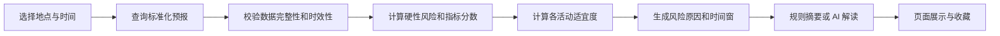

# 项目概述

## 1. 项目背景

普通天气应用主要回答“是否下雨、温度多少”，但海岛活动的风险由多项海洋气象指标共同决定。例如平均风速不高时，远方天气系统仍可能形成大浪或长周期涌浪；阵风、雷暴、低能见度和潮位变化也可能导致登岛或返航风险。

Windy 等工具能够展示丰富图层，但指标分散、模型差异明显，普通用户需要较高学习成本才能形成可靠判断。Marine Insight 因此定位为海岛海况智能决策平台：聚合标准化数据，执行确定性分析和活动评分，并用直观页面给出风险原因、适宜时段和返航提醒。

## 2. 产品定位

> 为海钓、登岛、乘船、露营和海岛摄影用户提供快速、可解释、可追溯的海况辅助决策。

系统不是航海导航或法定气象预警系统，不对人身和财产安全作保证。任何高风险提示、官方预警或现场管控都优先于系统评分。

## 3. 项目目标

### 3.1 用户价值目标

- 用户在 1 分钟内完成地点和时间选择并获得结论。
- 将风、浪、涌浪、雷暴等专业指标转为易理解的风险和行动建议。
- 展示未来风险变化，帮助用户选择出发、活动和返航时间。
- 每项结论可追溯到原始指标、数据来源和算法版本。

### 3.2 技术目标

- 通过 Provider 抽象支持 Windy、Open-Meteo 或其他合法授权数据源。
- 领域分析不依赖具体数据源、数据库和 AI 服务。
- 支持 PostgreSQL 生产环境、SQLite 本地开发和 Docker 部署。
- 在外部数据源或 AI 不可用时提供缓存或规则化降级结果。

## 4. 项目范围

### 4.1 MVP 范围

- 地名搜索、收藏海岛快捷入口和地图选点。
- 当前、24 小时、72 小时和 7 天逐小时预报查询。
- 风速/风向、阵风、有效波高、浪周期/浪向、涌浪、降雨、雷暴/CAPE、能见度、温度、湿度、气压、云量等标准化展示。
- 综合风险等级和海钓、乘船、登岛、露营、摄影活动评分。
- 风险因子、数据新鲜度、趋势图、推荐时段和返航截止建议。
- 匿名查询、限流、缓存、日志、健康检查和 Docker 部署。

### 4.2 第二阶段

- 潮汐、日出日落、黄金摄影时段、月相和海水温度。
- 用户登录、收藏地点、查询历史、单位和阈值偏好。
- AI 生成受规则约束的自然语言解读。
- 移动端优化和 PWA。

### 4.3 后续范围

- 多模型对比与融合置信度、洋流和岸线朝向分析。
- 航线风险、返航风险、主动预警和消息推送。
- 海岛推荐、钓鱼活跃指数、摄影指数深化。
- 微信小程序和原生移动客户端。

### 4.4 明确不包含

- 替代官方气象、海事、港口或船方安全决定。
- 未经授权抓取 Windy 页面或规避供应商配额与许可。
- MVP 阶段提供船舶导航、救援调度或自动驾驶能力。

## 5. 目标用户与场景

| 用户角色 | 核心场景 | 主要诉求 |
| --- | --- | --- |
| 海钓用户 | 选择海岛、钓点和出返航时间 | 风浪是否可接受、何时风险上升 |
| 登岛/乘船用户 | 判断码头靠泊和航程舒适度 | 阵风、浪高、涌浪和能见度风险 |
| 露营用户 | 判断帐篷、降雨、雷暴和夜间条件 | 阵风、雷雨、温湿度和风险时段 |
| 摄影用户 | 选择日出日落和能见度较好的窗口 | 云量、能见度、降雨及海面状态 |
| 管理员 | 维护数据源、阈值和算法版本 | 稳定性、可追溯性和配置审计 |

## 6. 核心业务流程

## 7. 成功指标

| 指标 | v1.0 目标 | 统计方式 |
| --- | --- | --- |
| 查询完成率 | >= 98%（含缓存降级） | API 成功与可用降级响应比例 |
| 缓存命中查询 P95 | <= 2 秒 | OpenTelemetry 指标 |
| 外部回源查询 P95 | <= 5 秒 | Provider 调用链指标 |
| 结论可追溯率 | 100% | 是否包含来源、观测时间、算法版本 |
| 关键规则测试覆盖 | 100% 边界用例 | 自动化测试报告 |
| 生产可用性 | >= 99.5% | 健康检查与监控 |

## 8. 约束与假设

- 数据源能力、区域覆盖、更新频率和商业许可需在接入前确认。
- 不同模型的时间分辨率和字段并不完全一致，结果必须携带缺失项和置信度。
- 初始目标区域为中国沿海及常用海岛，但领域模型不绑定具体区域。
- 默认采用 UTC 存储，按地点时区或用户时区展示。
- 一名开发者的 6 周计划是目标节奏，外部 API 审批可能影响时间。

## 9. 主要风险

| 风险 | 影响 | 应对措施 |
| --- | --- | --- |
| Windy 套餐不提供所需海洋字段 | MVP 数据不完整 | Provider 抽象、接入前验证、准备合规备选源 |
| 不同数据源模型差异 | 用户误解结果 | 展示来源/模型/更新时间，保留原始值与置信度 |
| 简化评分造成错误安全感 | 人身安全风险 | 硬性禁行、保守阈值、活动独立评分和免责声明 |
| 长周期涌浪被误判为舒适 | 岸边/礁石风险被低估 | 将周期与浪高、活动场景组合分析 |
| 外部 API 限流或故障 | 查询不可用 | 多级缓存、退避重试、熔断、备用 Provider |
| AI 生成错误建议 | 错误决策 | AI 不参与评分，结构化校验，失败时使用规则模板 |

## 10. 里程碑

| 里程碑 | 计划周期 | 交付物 |
| --- | --- | --- |
| M0 需求与骨架 | 第 1 周 | 文档基线、解决方案、CI、Provider 契约 |
| M1 可查询 MVP | 第 2 周 | 地点查询、天气/海浪接入、Dashboard |
| M2 核心分析 | 第 3-4 周 | 风险引擎、评分、趋势和测试样本 |
| M3 产品完善 | 第 5 周 | 地图、收藏/历史、潮汐或 AI 的首个增量 |
| M4 上线 | 第 6 周 | Docker、监控、安全加固、验收与发布 |

## 11. 变更记录

| 版本 | 日期 | 变更说明 |
| --- | --- | --- |
| 1.0 | 2026-07-13 | 根据产品对话补齐定位、范围、指标和风险 |
