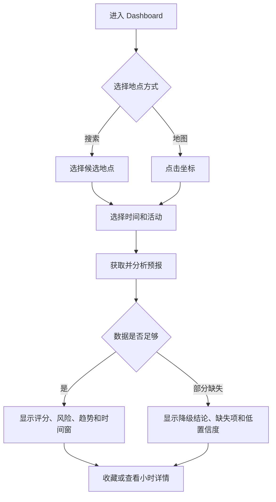

# 产品需求文档（PRD）

## 1. 文档目的

本文定义 Marine Insight `v1.0` 的产品目标、用户流程、功能优先级和验收口径，供需求评审、UI 设计、开发和测试共同使用。

## 2. 产品定位与价值

Marine Insight 是面向海岛活动的海况智能决策工具。用户不需要在多个天气、海浪和潮汐接口之间自行比对，而是通过一个查询获得：

- 当前及未来海况是否适合目标活动。
- 哪些指标构成主要风险。
- 最适合的活动窗口，以及风险预计何时上升。
- 数据来源、更新时间和结论可信程度。

产品首屏必须是可操作的查询与结果界面，不建设营销型落地页。

## 3. 用户角色

| 角色 | 特征 | 核心诉求 | 权限范围 |
| --- | --- | --- | --- |
| 匿名访客 | 临时查询、移动端为主 | 快速获得当前和未来结论 | 查询、地图选点、查看分析 |
| 注册用户 | 经常前往固定海岛 | 收藏、历史、偏好和跨设备同步 | 匿名能力 + 个人数据管理 |
| 管理员 | 维护系统运行 | 管理地点、数据源、阈值和算法版本 | 后台配置、审计和重算 |

## 4. 核心用户场景

### 4.1 出发前查询

- 前置条件：用户知道目的地和计划日期。
- 主流程：搜索地点或地图选点，选择活动与时间，查看综合风险、趋势和建议窗口。
- 异常流程：数据缺失时展示可用指标、缺失项和降级状态，不生成虚假的完整结论。
- 预期结果：用户可判断是否出发、调整时间或取消计划。

### 4.2 当日返航规划

- 前置条件：已选地点并获得逐小时预报。
- 主流程：系统识别阵风、浪高、涌浪、雷暴或能见度的恶化拐点，给出保守的建议返航时间。
- 预期结果：页面突出显示“建议在 16:00 前返航”及触发原因。

### 4.3 风小浪大的隐蔽风险

- 前置条件：平均风速较低，但有效波高或涌浪较高。
- 主流程：系统禁止仅凭风速给出低风险结论，显著提示远洋涌浪、偶发更高浪和礁石拍浪风险。
- 预期结果：乘船、登岛、矶钓等活动得分降低或触发不建议。

### 4.4 常用地点复查

- 前置条件：注册用户已有收藏地点。
- 主流程：从收藏列表一键查询默认活动和时间范围，可复用单位偏好。
- 预期结果：减少重复输入，并保留最近查询结果。

## 5. 功能需求

| 编号 | 功能 | 优先级 | 产品描述 | 验收标准 |
| --- | --- | --- | --- | --- |
| FR-001 | 地点搜索 | P0 | 按海岛、港口、城市或坐标定位 | 可返回候选地点、经纬度和时区 |
| FR-002 | 地图选点 | P0 | 使用天地图/Leaflet 选择任意坐标 | 点击后可发起同一套查询流程 |
| FR-003 | 时间范围 | P0 | 查询当前、24h、72h、7d 逐小时预报 | 时间按地点时区展示并可切换 |
| FR-004 | 指标面板 | P0 | 展示风、阵风、浪、周期、涌浪、雷暴等 | 单位、时间、来源和缺失状态清晰 |
| FR-005 | 综合风险 | P0 | 生成 0-100 分、五级结论和风险标签 | 分数与阈值一致，硬性风险不可被抵消 |
| FR-006 | 活动评分 | P0 | 海钓、乘船、登岛、露营、摄影独立评分 | 相同天气可因活动不同产生不同结论 |
| FR-007 | 风险解释 | P0 | 展示主要扣分项、硬性风险和数据置信度 | 每条风险可追溯到指标和规则 |
| FR-008 | 趋势与时间窗 | P0 | 绘制逐小时趋势并推荐适宜窗口 | 能识别风险上升时点和返航截止建议 |
| FR-009 | 缓存与降级 | P0 | 数据源不可用时使用仍有效的缓存 | 显示缓存年龄，不伪装成实时数据 |
| FR-010 | 收藏地点 | P1 | 登录用户保存地点、默认活动和备注 | 支持新增、排序、删除和一键查询 |
| FR-011 | 查询历史 | P1 | 保存用户近期查询与结论摘要 | 支持再次查询，不永久保存匿名历史 |
| FR-012 | 潮汐与天文 | P1 | 展示潮位、涨退潮、日出日落和月相 | 数据缺失不影响基础海况分析 |
| FR-013 | AI 解读 | P1 | 将规则结果转为自然语言摘要 | 不改变分数、风险级别和硬性禁行 |
| FR-014 | 个性化单位 | P1 | 风速、浪高、温度单位切换 | 换算仅影响展示，不改变内部标准值 |
| FR-015 | 管理配置 | P1 | 管理数据源、地点、阈值和算法发布 | 变更有版本、审计和回滚能力 |
| FR-016 | 预警推送 | P2 | 收藏地点风险恶化时主动通知 | 用户可订阅、退订并设置静默时间 |
| FR-017 | 多模型对比 | P2 | 比较 ECMWF/GFS/ICON 等模型差异 | 显示分歧，不用简单平均掩盖不确定性 |

## 6. 指标与产品表达

### 6.1 第一优先级

- 平均风速与风向。
- 阵风及阵风/平均风速比。
- 有效波高、浪周期和浪向。
- 主/次涌浪高度、周期和方向。
- 雷暴、降雨和 CAPE。

### 6.2 第二优先级

- 能见度、云量、温度、湿度、气压、紫外线。
- 海水温度、潮汐、日出日落、月相和洋流。

### 6.3 表达原则

- 有效波高必须注明“偶发浪可能明显高于该值”。
- 长周期浪不能统一标为绿色；对乘船可能较平缓，对礁石、岸边、浮潜和登岛可能能量更强。
- 风向、浪向必须结合岛屿岸线/活动点朝向后才可判断迎风、背风或正面冲浪。
- 风险状态使用文字、图标和颜色共同表达，不只依赖星级或颜色。

## 7. 核心页面

| 页面 | 使用角色 | 核心内容 | 主要操作 |
| --- | --- | --- | --- |
| 海况 Dashboard | 全部 | 查询栏、总分、活动建议、风险、趋势 | 搜索、选时、切活动、刷新 |
| 地图选点 | 全部 | 地图、坐标、附近地点 | 点击选点、确认查询 |
| 小时详情 | 全部 | 单小时全部指标与规则贡献 | 切换小时、查看来源 |
| 收藏地点 | 注册用户 | 收藏、默认活动、最近分数 | 排序、编辑、删除、查询 |
| 查询历史 | 注册用户 | 查询条件、时间和结果摘要 | 筛选、再次查询 |
| 系统设置 | 注册用户 | 单位、时区、默认活动 | 修改与恢复默认 |
| 管理后台 | 管理员 | Provider、算法、地点和审计 | 测试连接、发布配置、回滚 |

## 8. 核心交互流程

## 9. 数据与产品指标

| 事件 | 触发时机 | 关键属性 | 用途 |
| --- | --- | --- | --- |
| `forecast_query_started` | 提交查询 | 地点类型、范围、活动 | 了解查询需求 |
| `forecast_query_completed` | 结果可用 | 耗时、Provider、缓存命中 | 性能与稳定性 |
| `analysis_viewed` | 结果进入视口 | 风险级别、主要风险 | 结果分布与规则校准 |
| `favorite_added` | 收藏地点 | 地点、默认活动 | 常用地点分析 |
| `ai_summary_failed` | AI 降级 | 模型、错误类型 | AI 稳定性治理 |

埋点禁止包含 API Key、访问令牌和不必要的精确个人位置。

## 10. 非功能产品要求

- 移动端 360px 宽度下核心结论、查询控件和风险标签不得重叠。
- 首次查询有明确加载进度，可取消长请求；失败后提供重试。
- 数据超过新鲜度阈值时必须显示“缓存数据”和更新时间。
- 所有危险结论必须可在不使用颜色的情况下识别。
- 无 AI、无登录或 Redis 不可用时，P0 查询和规则分析仍可工作。

## 11. 发布验收

v1.0 上线必须满足：

1. P0 功能全部通过验收和端到端测试。
2. 关键阈值和硬性禁行规则具有边界测试。
3. 数据源失败、超时、缺失和过期场景均可解释降级。
4. 页面展示来源、更新时间、算法版本和安全免责声明。
5. Docker 环境完成数据库迁移、健康检查、备份和回滚演练。

## 12. 变更记录

| 版本 | 日期 | 变更说明 |
| --- | --- | --- |
| 1.0 | 2026-07-13 | 根据产品构想补齐角色、场景、功能和验收标准 |
| 1.1 | 2026-07-13 | 更新数据源定位，明确多来源数据由系统统一解释 |
