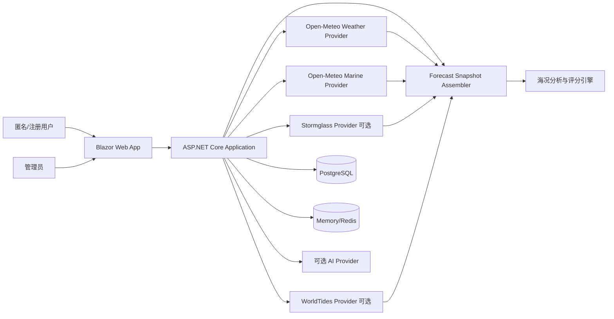

# 需求规格说明书（SRS）

## 1. 文档信息

| 项目 | 内容 |
| --- | --- |
| 系统名称 | Marine Insight（海岛天气智能分析系统） |
| 产品定位 | 海岛海况智能决策平台 |
| 项目版本 | v1.0 |
| 文档版本 | v1.0 |
| 编写日期 | 2026-07-13 |
| 技术基线 | C# / .NET 10 / Blazor Web App |
| 数据库 | PostgreSQL；SQLite 用于本地开发 |
| 部署平台 | Linux Docker；可选 Windows IIS |

## 2. 系统目标与边界

系统将多个天气与海洋数据源转换为统一的逐小时预报，基于确定性规则生成综合风险、活动适宜度、风险原因和建议时间窗，并可选使用 AI 生成自然语言解读。

系统是辅助决策工具，不是法定预警、船舶导航或救援系统。官方预警、港口管控和现场判断具有更高优先级。

## 3. 系统上下文



## 4. 用户与权限

| 角色 | 能力 |
| --- | --- |
| 匿名用户 | 地点查询、地图选点、查看预报、分析和趋势 |
| 注册用户 | 匿名能力、收藏、历史、单位与默认活动设置 |
| 管理员 | Provider 配置、地点维护、算法版本发布、审计查看 |

## 5. 功能需求

### 5.1 地点与时间查询

- `FR-001` 系统应支持按地名搜索海岛、港口、码头和行政区域。
- `FR-002` 系统应支持输入经纬度或通过地图选点。
- `FR-003` 地点记录应包含经纬度、时区、显示名称和可选岸线朝向。
- `FR-004` 系统应支持当前、未来 24 小时、72 小时和 7 天逐小时查询。
- `FR-005` 所有时间在内部使用 UTC，响应同时提供地点本地时间和时区。

### 5.2 天气与海况数据

- `FR-010` 系统应获取并标准化平均风速、阵风和风向。
- `FR-011` 系统应获取有效波高、浪周期和浪向。
- `FR-012` 在数据源支持时，应获取主/次涌浪高度、周期和方向。
- `FR-013` 系统应获取降雨、雷暴或雷暴概率、CAPE、能见度、温度、湿度、气压和云量。
- `FR-014` UV、海水温度、潮汐、日出日落、月相和洋流允许作为可选字段分阶段接入。
- `FR-015` 每个标准化数据点应保留 Provider、数据域、模型、原始发布时间、预报时间、抓取时间和质量状态。
- `FR-016` 缺失值不得默认填充为 0；必须使用 `null` 和质量标记表达。
- `FR-017` Weather、Marine、Tide 和 Observation 应分别形成不可变来源批次，分析输入通过批次集合组装。
- `FR-018` 分析结果应记录全部来源批次及其用途，不能只保存一个“主 Provider”而丢失其他指标来源。

### 5.3 分析与评分

- `FR-020` 系统应为每个小时生成 0-100 综合分和风险等级。
- `FR-021` 系统应分别生成海钓、乘船、登岛、露营和摄影活动分数。
- `FR-022` 系统应识别大风、强阵风、大浪、短周期风浪、长周期涌浪、雷暴、低能见度和数据不足风险。
- `FR-023` 硬性禁行规则一旦触发，最终等级不得被其他良好指标抵消。
- `FR-024` 系统应输出每项扣分、触发阈值、实际值、影响活动和严重度。
- `FR-025` 系统应根据连续逐小时结果计算推荐活动窗口和保守返航截止时间。
- `FR-026` 分析结果必须包含算法版本和置信度。

### 5.4 结果展示

- `FR-030` Dashboard 应优先展示地点、数据时间、综合结论、主要风险和活动建议。
- `FR-031` 系统应展示风速/阵风、浪高/周期、涌浪、雷暴和能见度趋势。
- `FR-032` 用户应能查看任一小时的完整指标、来源和规则贡献。
- `FR-033` 有效波高旁应展示偶发浪可能更高的提示。
- `FR-034` 数据过期、部分缺失或使用缓存时必须有明显状态。
- `FR-035` 风险不得只通过颜色表达。

### 5.5 用户数据

- `FR-040` 注册用户应能收藏地点并设置默认活动、备注和排序。
- `FR-041` 系统应保存注册用户近期查询历史，并支持再次查询。
- `FR-042` 用户可设置风速、浪高、温度单位和默认时区。
- `FR-043` 用户可删除个人收藏、历史和设置数据。

### 5.6 AI 解读

- `FR-050` AI 只能读取标准化指标、确定性分析结果和固定安全约束。
- `FR-051` AI 输出必须符合结构化 Schema，包括摘要、主要原因、风险时段和免责声明。
- `FR-052` AI 不得修改分数、风险等级、硬性禁行或算法计算的时间窗。
- `FR-053` AI 失败、超时或输出不合法时，系统应使用规则模板生成摘要。

### 5.7 管理能力

- `FR-060` 管理员可启停 Provider、测试连接并查看配额状态。
- `FR-061` 管理员可创建、校验、发布和回滚算法参数版本。
- `FR-062` 算法发布后，已有结果保留原版本；需要重算时创建新结果。
- `FR-063` 敏感配置仅能通过受保护配置源维护，不在页面回显完整密钥。

## 6. 标准数据模型

单个逐小时预报至少包含：

```csharp
public sealed record MarineForecastPoint(
    DateTimeOffset ForecastTime,
    double? WindSpeedMs,
    double? WindGustMs,
    double? WindDirectionDeg,
    double? WaveHeightM,
    double? WavePeriodS,
    double? WaveDirectionDeg,
    double? WindWaveHeightM,
    double? WindWavePeriodS,
    double? WindWaveDirectionDeg,
    double? SwellHeightM,
    double? SwellPeriodS,
    double? SwellDirectionDeg,
    double? PrecipitationMm,
    double? CapeJkg,
    double? VisibilityM,
    double? TemperatureC,
    double? HumidityPercent,
    double? PressureHpa,
    double? CloudCoverPercent,
    double? SeaTemperatureC,
    double? CurrentSpeedMs,
    double? CurrentDirectionDeg,
    double? TideHeightM,
    bool? Thunderstorm,
    ForecastQuality Quality,
    IReadOnlyDictionary<string, MetricSourceReference> MetricSources);
```

内部标准单位固定为 `m/s`、`m`、`s`、`degree`、`mm`、`C`、`hPa`。展示层负责单位换算。`MetricSources` 记录每个非空指标对应的批次、Provider、模型和质量状态；潮汐极值等非逐小时结构使用独立的 Tide DTO 表达。

## 7. 初始业务规则基线

以下阈值是 v1.0 初始参数，不作为普适海事标准，必须支持版本化配置和样本校准。

| 指标 | 低风险参考 | 关注 | 高风险参考 |
| --- | --- | --- | --- |
| 平均风速 | <= 5 m/s | 5-8 m/s | >= 8 m/s；>= 13 m/s 硬性高危 |
| 阵风 | <= 6 m/s | 阵风/风速 > 1.5 | >= 12 m/s 高风险 |
| 有效波高 | < 0.5 m | 0.5-1.0 m | >= 1.0 m 显著风险；>= 2.0 m 硬性高危 |
| 浪周期 | 6-12 s 结合浪高判断 | < 6 s 易颠簸 | >= 10 s 且有明显涌浪时提高岸边风险 |
| 涌浪高度 | < 0.5 m | 0.5-1.0 m | >= 1.5 m 高风险 |
| CAPE | < 500 J/kg | 500-1000 J/kg | >= 1000 J/kg 结合雷暴数据提高风险 |
| 能见度 | >= 10 km | 2-10 km | < 2 km 高风险；< 0.5 km 硬性高危 |

雷暴预警、官方高影响天气预警、数据严重过期或关键字段不足，可直接触发不建议或“无法可靠判断”。

## 8. 风险等级

| 分数 | 等级 | 星级 | 产品建议 |
| --- | --- | --- | --- |
| 90-100 | VeryGood | 5 | 非常适宜 |
| 80-89 | Good | 4 | 适宜，关注轻微变化 |
| 70-79 | Moderate | 3 | 一般，需按活动和经验判断 |
| 50-69 | Caution | 2 | 谨慎，不建议经验不足者开展高暴露活动 |
| 0-49 | Avoid | 1 | 不建议 |

硬性禁行触发时最高只能为 `Avoid`；数据不足时返回 `Unknown`，不得用中间分数掩盖不确定性。

## 9. 外部接口需求

| 能力 | 初始方案 | 约束 |
| --- | --- | --- |
| 常规天气 | Open-Meteo Weather API | MVP 默认；上线前确认非商业/商业条款和实际配额 |
| 海浪/涌浪 | Open-Meteo Marine API | MVP 默认；与 Weather 批次独立保存和时间对齐 |
| 专业海洋增强 | Stormglass.io | 默认关闭；按预算用于多来源、海温、洋流或潮汐增强 |
| 潮汐 | WorldTides | P1 可选；按 Credit 预算、长 TTL 缓存和额度告警运行 |
| 原始模型/观测 | NOAA/NCEP WW3、NDBC | v2.0 后台文件管线和校准数据，不进入 MVP 热路径 |
| 地图 | OpenStreetMap + Leaflet | 遵守瓦片使用政策，生产可配置服务商 |
| AI | 可插拔 LLM Provider | 可完全关闭，超时后规则降级 |
| 数据库 | PostgreSQL | EF Core 迁移管理 |
| 缓存 | Memory + 可选 Redis | Redis 失败不阻断基本查询 |

禁止通过页面抓取或未授权接口规避第三方服务条款。

## 10. 非功能需求

### 10.1 性能

- `NFR-001` 缓存命中查询 P95 应 <= 2 秒。
- `NFR-002` 正常外部回源查询 P95 应 <= 5 秒，不含供应商明确长延迟。
- `NFR-003` Dashboard 初次只加载必要数据，图表和小时详情允许延迟加载。
- `NFR-004` 所有长请求支持 `CancellationToken`。

### 10.2 可用性与恢复

- `NFR-010` 生产月可用性目标 >= 99.5%。
- `NFR-011` 外部 Provider 使用超时、有限重试、熔断和缓存降级。
- `NFR-012` 健康检查区分存活、就绪和外部依赖状态。
- `NFR-013` Provider 路由必须受日/月预算、剩余额度和功能开关控制，付费 fallback 不得无上限自动触发。

### 10.3 安全与隐私

- `NFR-020` 所有生产流量使用 HTTPS。
- `NFR-021` API Key、连接字符串和令牌不得写入代码、日志或镜像。
- `NFR-022` 匿名查询按 IP/设备维度限流，登录接口具备防暴力破解措施。
- `NFR-023` 精确位置和查询历史遵循最小化存储，用户可删除个人数据。

### 10.4 可维护性

- `NFR-030` Domain 不引用第三方 Provider DTO、EF Core 或 UI 类型。
- `NFR-031` 核心规则、单位换算和 Provider 映射必须有自动化测试。
- `NFR-032` API、算法、提示词和数据库迁移均有明确版本。

### 10.5 可观测性

- `NFR-040` 使用结构化日志和 OpenTelemetry 记录端到端 Trace。
- `NFR-041` 监控查询量、延迟、错误率、缓存命中、Provider 配额和降级率。
- `NFR-042` 任何分析结果可通过 `traceId`、数据批次和算法版本复现。

### 10.6 兼容性与可访问性

- `NFR-050` 支持当前主流 Chromium、Edge、Safari 和移动端浏览器。
- `NFR-051` 360px 至桌面宽屏下不得出现核心控件和文字重叠。
- `NFR-052` 核心操作支持键盘，风险信息具备文字标签和足够对比度。

## 11. 验收场景

| 编号 | 场景 | 预期结果 |
| --- | --- | --- |
| AC-001 | 风 3 m/s、浪 2.5 m、涌浪 2 m | 不得判定为适宜，突出“风小浪大”风险 |
| AC-002 | 风 4 m/s、阵风 11 m/s | 识别阵风比异常并降低露营/乘船评分 |
| AC-003 | 浪 0.8 m、周期 4 s | 提示短周期颠簸，乘船舒适度下降 |
| AC-004 | 浪 0.8 m、涌浪周期 12 s、礁石活动 | 提示长周期涌浪与拍岸风险，不统一标绿 |
| AC-005 | 雷暴为真或官方雷暴预警 | 触发硬性不建议，AI 不得改写 |
| AC-006 | Provider 超时但缓存仍有效 | 返回缓存结果，显示缓存年龄和降级状态 |
| AC-007 | 缺少浪高和涌浪 | 返回低置信度或无法判断，不用 0 代替 |
| AC-008 | 17:00 后风险连续升高 | 推荐窗口截止早于风险时点并给出返航建议 |
| AC-009 | Open-Meteo Weather 新鲜但 Marine 使用旧缓存 | 分别显示两个批次时间，整体置信度不能只按较新批次计算 |
| AC-010 | WorldTides 不可用 | 基础海况继续返回，潮汐相关结论明确降级 |
| AC-011 | Stormglass 关闭且 Open-Meteo 关键字段缺失 | 不产生付费调用，返回 Partial/Unknown 和缺失原因 |

## 12. 变更记录

| 版本 | 日期 | 变更说明 |
| --- | --- | --- |
| 1.0 | 2026-07-13 | 重构为可实施、可测试且具安全边界的需求规格 |
| 1.1 | 2026-07-13 | 切换为 Open-Meteo 主源并引入多来源批次追溯需求 |
