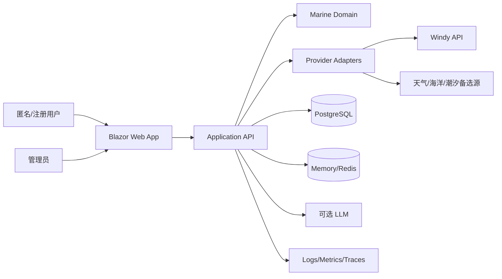
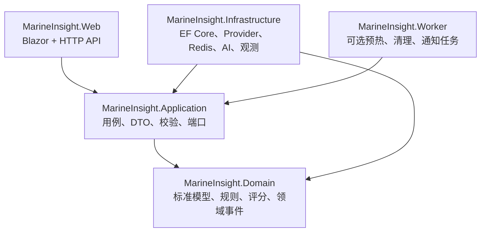
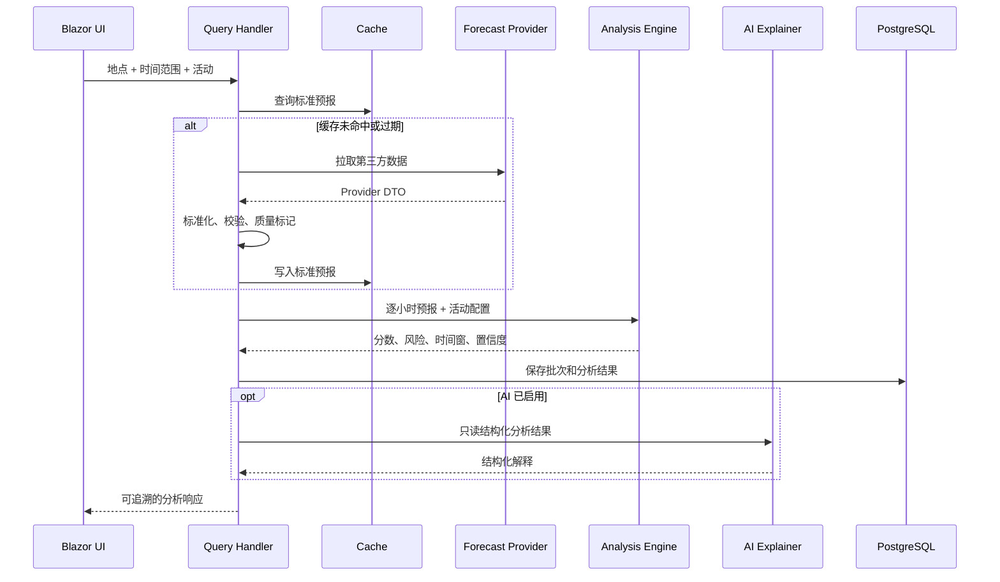
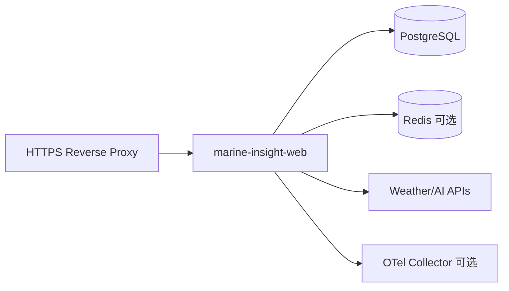

# 系统架构设计（SAD）

## 1. 架构目标

- 将地点、预报、分析和用户能力分离，控制业务复杂度。
- 通过防腐层隔离 Windy 等第三方字段、协议和故障模式。
- 保证没有 AI、Redis 或单个外部数据源时，核心查询仍可降级运行。
- 使任一分析结论可通过数据批次、算法版本和 Trace 复现。
- 支持单机 Docker 起步，并保留横向扩展和多 Provider 能力。

## 2. 架构原则

1. **规则优先**：安全评分由确定性领域规则生成，AI 不参与最终决策。
2. **依赖倒置**：Domain/Application 定义端口，Infrastructure 实现 Provider、数据库和缓存。
3. **标准模型**：外部 DTO 先转换为统一单位和质量状态，禁止渗透到业务层。
4. **保守降级**：数据缺失或过期降低置信度，不能用默认 0 制造低风险假象。
5. **先模块化单体**：v1.0 使用模块化单体降低部署成本，按边界保留未来拆分能力。

## 3. 系统上下文



## 4. 逻辑架构



建议解决方案结构：

```text
src/
├── MarineInsight.Domain/
├── MarineInsight.Application/
├── MarineInsight.Infrastructure/
├── MarineInsight.Web/
└── MarineInsight.Worker/          # 二期按需要启用
tests/
├── MarineInsight.Domain.Tests/
├── MarineInsight.Application.Tests/
├── MarineInsight.Infrastructure.Tests/
└── MarineInsight.Web.Tests/
```

## 5. 模块职责

| 模块 | 职责 | 不允许依赖 |
| --- | --- | --- |
| Location | 地名搜索、坐标、时区、岸线信息 | Provider DTO、UI |
| Forecast | 拉取、标准化、质量校验、批次存储 | 评分和页面模型 |
| Analysis | 硬性风险、评分、活动适配、时间窗 | HTTP、EF Core、LLM |
| User | 收藏、历史、单位和默认活动 | 第三方天气 API |
| AI Explanation | 基于规则结果生成可读摘要 | 修改领域分数和风险等级 |
| Administration | Provider/算法配置、审计、重算 | 绕过领域校验直接改结果 |

## 6. 关键业务流程



## 7. 技术选型

| 类别 | 选型 | 理由 | 备选 |
| --- | --- | --- | --- |
| 运行时 | .NET 9 / ASP.NET Core | 与用户技术栈一致，性能和可观测性完善 | .NET 8 LTS |
| UI | Blazor Web App + MudBlazor | C# 全栈、组件成熟、响应式支持 | 原生 Razor 组件 |
| 图表 | ApexCharts for Blazor | 逐小时多序列展示成熟 | ECharts 封装 |
| 地图 | Leaflet + OpenStreetMap | 轻量、易于坐标选点 | MapLibre |
| 数据访问 | EF Core | 迁移、测试和 PostgreSQL 支持 | Dapper 用于热点查询 |
| 数据库 | PostgreSQL | 稳定、索引和 JSON 能力完善 | SQLite 本地开发 |
| 缓存 | IMemoryCache + 可选 Redis | 单机简单、扩展时共享缓存 | PostgreSQL 缓存表 |
| 韧性 | Microsoft.Extensions.Http.Resilience | 超时、重试、熔断标准化 | Polly 直接配置 |
| 观测 | OpenTelemetry + Serilog | 统一日志、指标和 Trace | 平台原生日志 |
| 测试 | xUnit + FluentAssertions + bUnit + Playwright | 覆盖领域、组件和端到端 | NUnit |

## 8. 数据架构

- PostgreSQL 保存地点、预报批次、标准化点位、分析结果、算法版本和用户数据。
- Redis/Memory 保存短期预报、分析响应和防重复回源锁，不作为事实唯一来源。
- 原始 Provider 响应可按调试配置短期保存并脱敏，默认不长期保留。
- 所有时序记录以 UTC 存储；经纬度初期使用定点精度，复杂空间查询再引入 PostGIS。

## 9. 部署架构

v1.0 默认采用单区域 Docker Compose：



Web 应保持无状态，用户会话和持久数据不依赖容器本地磁盘。Worker 可在需要预热、通知或大批量重算时独立部署。

## 10. 质量属性

- 性能：缓存命中 P95 <= 2 秒，外部回源 P95 <= 5 秒。
- 可用性：Provider 超时 3-5 秒、有限重试、熔断和有效缓存降级。
- 安全：HTTPS、最小权限、密钥外置、限流、审计和个人数据删除。
- 可测试：领域规则为纯函数或无外部副作用服务，Provider 使用契约测试。
- 可观测：每次查询记录 TraceId、Provider、缓存状态、数据批次和算法版本。

## 11. 架构决策记录

| 编号 | 决策 | 状态 | 影响 |
| --- | --- | --- | --- |
| ADR-001 | v1.0 采用模块化单体 | 已接受 | 降低部署复杂度，保留清晰模块边界 |
| ADR-002 | Domain 使用统一海洋气象模型 | 已接受 | 第三方 API 可替换，增加映射工作 |
| ADR-003 | 评分引擎确定性，AI 仅解释 | 已接受 | 安全可测，文本表现与模型解耦 |
| ADR-004 | PostgreSQL 生产、SQLite 本地 | 已接受 | 迁移需验证提供程序差异 |
| ADR-005 | Redis 为可选增强依赖 | 已接受 | 单机易启动，分布式时需启用共享缓存 |

## 12. 变更记录

| 版本 | 日期 | 变更说明 |
| --- | --- | --- |
| 1.0 | 2026-07-13 | 建立模块化单体、Provider 防腐层和确定性分析架构 |
