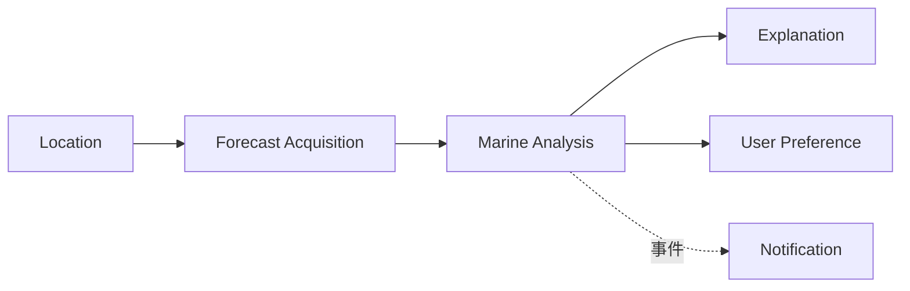

# 领域模型设计（DDD）

## 1. 核心领域

Marine Insight 的核心领域不是“展示天气”，而是将标准化海洋气象数据转换为不同海岛活动的风险结论。数据采集、用户收藏和 AI 解读是支撑域，海况分析与评分是核心域。

## 2. 通用语言

| 术语 | 定义 |
| --- | --- |
| 预报批次（Forecast Batch） | 某 Provider、模型、地点和发布时间对应的一组逐小时预报 |
| 预报点（Forecast Point） | 单个预报时间上的标准化气象与海况指标 |
| 有效波高 | 统计意义上的代表性较大浪高，不等于最大单浪 |
| 涌浪（Swell） | 由远方天气系统传播而来的波浪分量 |
| 硬性风险（Safety Gate） | 一旦触发就不能被其他良好指标抵消的风险 |
| 活动配置（Activity Profile） | 某类活动关注的指标、阈值和权重 |
| 分析报告（Analysis Report） | 某地点和时间范围的评分、风险、时间窗和置信度 |
| 置信度 | 基于字段完整性、数据时效性和模型分歧计算的可靠程度 |
| 推荐窗口 | 连续满足活动最低条件的一段时间 |
| 返航截止 | 在风险上升前预留安全缓冲后的保守时间点 |

## 3. 限界上下文

| 上下文 | 职责 | 类型 | 集成方式 |
| --- | --- | --- | --- |
| Location | 地点、坐标、时区、岸线元数据 | 支撑域 | 通过 LocationId/GeoPoint 提供给其他上下文 |
| Forecast Acquisition | Weather/Marine/Tide Provider 调用、标准化、质量校验 | 支撑域 | 发布 ForecastBatchReady |
| Marine Analysis | 风险规则、评分、活动适配、时间窗 | 核心域 | 消费标准预报，产出 AnalysisReport |
| User Preference | 收藏、历史、单位和默认活动 | 通用域 | 只引用 LocationId 和 AnalysisId |
| Explanation | 规则模板和 AI 自然语言解释 | 支撑域 | 只读 AnalysisReport 投影 |
| Notification | 风险恶化订阅和推送 | 后续支撑域 | 订阅 AnalysisCompleted/RiskEscalated |

## 4. 聚合设计

### 4.1 Location 聚合

- 聚合根：`Location`。
- 值对象：`GeoPoint`、`TimeZoneId`、`CoastOrientation`。
- 不变式：纬度 `[-90, 90]`、经度 `[-180, 180]`；规范名称不能为空；岸线朝向允许未知。
- Application 通过 `ILocationRepository` 只读访问预置地点；搜索按规范化名称匹配，附近查询按球面距离排序，不把外部地理编码 Provider 引入领域边界。
- `MarineAnalysisQuery` 可保留选中 `Location` 的 ID、展示名称和时区元数据；Provider 端口仍只接收 `GeoPoint`，避免基础设施身份泄漏到数据源适配层。

### 4.2 ForecastBatch 聚合

- 聚合根：`ForecastBatch`。
- 实体：`ForecastPoint`。
- 值对象：`ProviderIdentity`、`ForecastMetricSet`、`DataQuality`。
- 不变式：同一批次中地点、Provider、数据域、模型和发布时间一致；预报时间唯一且升序；缺失值使用空值而不是 0。
- 批次创建后不可修改指标，只能创建新批次，保证分析可复现。
- 持久化由 Application 的 `IForecastBatchRepository` 负责追加和读取；由于 Provider 批次以坐标表达地点，追加时显式传入 `locationId`，避免把数据库身份耦合进 Provider 端口。
- `AppendAsync` 只追加完整批次图；`GetByIdAsync` 和 `FindAsync` 读取点位及逐指标来源引用。批次级缺失指标由逐点缺失位图恢复，缺失值始终保持为空，不补零。

### 4.3 ForecastSnapshot 分析输入模型

- `ForecastSnapshot` 不是第三方响应，而是由多个 `ForecastBatch` 按 UTC 时间轴组装的不可变领域输入。
- 值对象：`SourceBatchReference`、`MetricSource`、`SnapshotQuality`。
- 不变式：每个指标必须能追溯到批次、Provider 和模型；多来源同名指标必须经过显式选择策略；不能用较新的 Weather 批次掩盖过期 Marine/Tide 批次。
- Open-Meteo Weather、Open-Meteo Marine 和可选 WorldTides 通常形成 2-3 个来源批次。
- 当前实现由 Application 的 `ForecastSnapshotAssembler` 负责：每个数据域默认只能选择一个批次；同域多批次和合并后的同指标多来源都必须通过显式 Provider 选择策略确定。
- 时间轴使用所选批次在请求范围内的时间并集；允许配置最大最近点差，默认 30 分钟。允许最近点匹配时保留 `MetricSource.ForecastTimeUtc` 的实际来源时间，并将 `TimeGap`/`Partial` 传递到快照质量；超过上限不跨缺口填充。
- `ForecastSnapshotPoint`、`SnapshotQuality` 和 `SourceBatchReference` 位于 Domain，Assembler 不暴露 Provider DTO，也不改变输入 `ForecastBatch`。

### 4.4 AnalysisReport 聚合

- 聚合根：`AnalysisReport`。
- 实体：`HourlyAssessment`、`RiskFactor`、`ActivityAssessment`、`RecommendationWindow`。
- 值对象：`Score`、`RiskLevel`、`Confidence`、`AlgorithmVersion`。
- 不变式：分数范围为 0-100；硬性风险触发时等级必须为 `Avoid`；数据不足时允许 `Unknown`，不得伪造分数。
- 当前 `MI-0016` 已先落地单小时 `HourlyMarineAssessment`、`RiskContribution`、`RiskLevel` 和 `MarineRiskRuleEngine`；`MI-0017` 已补充 `ActivityType`、`ActivityProfile`、`ActivityMarineAssessment` 和活动评分服务，并把活动结果投影到查询结果、API 和 Dashboard；`MI-0018` 已补充 `RecommendationWindow` 和推荐窗口规划服务；`MI-0029` 已落地 `AnalysisReport` 持久化聚合（`AnalysisRisk`、`AnalysisSourceBatch` 值对象 + `IAnalysisReportRepository` 端口），仅登录用户查询时保存摘要（评分/等级/置信度/最佳推荐窗口 + 非 Info 风险 + 来源批次引用），支持按 id 回读。历史对比（多结果并排）仍留后续任务。

### 4.5 UserProfile 聚合

- 聚合根：`UserProfile`。
- 实体：`FavoriteLocation`、`UserSetting`。
- 不变式：收藏地点在单个用户内唯一；单位偏好必须来自受支持枚举；用户只能访问自己的数据。

### 4.6 AlgorithmVersion 聚合

- 聚合根：`AlgorithmVersion`。
- 状态：`Draft -> Validated -> Published -> Retired`。
- 不变式：已发布版本不可原地修改；同时只能有一个默认发布版本；发布和回滚必须审计。
- 当前 `MI-0021` 已在 Domain 落地 `AlgorithmVersion`、`MarineAlgorithmParameters`、参数 Schema 版本、配置哈希和发布前校验结果；校验覆盖 Safety Gate、分段惩罚、组合规则、活动 Profile、置信度、推荐窗口和 `GS-001` 至 `GS-010` 黄金样本回放门禁。仓储、管理员发布 API、默认版本唯一约束和审计持久化仍待后续任务。

## 5. 值对象

| 值对象 | 核心属性 | 规则 |
| --- | --- | --- |
| GeoPoint | Latitude, Longitude | 创建时验证范围和精度 |
| Wind | Speed, Gust, Direction | 内部单位 m/s、degree |
| Wave | Height, Period, Direction | 内部单位 m、s、degree |
| Score | Value | 0-100，不允许 NaN |
| Confidence | Value, Reasons | 0-1，并保留降低原因 |
| TimeWindow | Start, End | Start < End，使用 DateTimeOffset |
| DataQuality | Freshness, Completeness, Flags | 明确缺失、过期、异常和降级 |

## 6. 领域服务

| 服务 | 职责 | 输入 | 输出 |
| --- | --- | --- | --- |
| `ForecastSnapshotAssembler` | 对齐多数据域批次并保留指标来源 | ForecastBatch 集合 | ForecastSnapshot |
| `MarineAnalysisService` | 编排逐小时确定性分析 | ForecastSnapshot, ActivityProfiles | AnalysisReport |
| `SafetyGateEvaluator` | 判断不可抵消风险 | ForecastPoint, RuleSet | SafetyGateResult |
| `ScoreCalculator` | 计算指标和活动分数 | ForecastPoint, RuleSet | ScoreBreakdown |
| `WindowPlanner` | 计算推荐窗口和返航截止 | HourlyAssessment 列表 | RecommendationWindow 列表 |
| `ConfidenceCalculator` | 根据完整性/时效/分歧计算置信度 | DataQuality | Confidence |
| `CoastExposureService` | 根据风浪方向和岸线朝向判断暴露 | Direction, CoastOrientation | ExposureLevel |

当前 `MI-0016` 以 `MarineRiskRuleEngine` 合并单小时 Safety Gate、基础惩罚、组合风险和简化置信度计算；`MI-0018` 使用 `MarineRecommendationWindowPlanner` 在逐小时活动评估之上计算推荐窗口、风险上升点和返航截止。后续可拆分为独立 `SafetyGateEvaluator`、`ScoreCalculator`、`WindowPlanner` 和 `ConfidenceCalculator`，以支持版本化参数和活动配置。

## 7. 领域事件

| 事件 | 触发条件 | 订阅方 | 主要数据 |
| --- | --- | --- | --- |
| `ForecastBatchReady` | 任一标准化批次保存成功 | Snapshot 组装、缓存 | BatchId, LocationId, DataDomain |
| `AnalysisCompleted` | 分析报告创建成功 | UI 投影、历史、通知 | AnalysisId, RiskLevel |
| `SafetyGateTriggered` | 任一硬性风险触发 | 日志、通知 | RuleCode, Time, Severity |
| `RiskEscalated` | 新结果相对前次明显恶化 | 通知 | PreviousLevel, CurrentLevel |
| `AlgorithmPublished` | 新算法版本发布 | 缓存、审计 | Version, Publisher |

## 8. 仓储与端口

| 接口 | 聚合/用途 | 主要操作 |
| --- | --- | --- |
| `ILocationRepository` | Location | 查找、保存、附近查询 |
| `IForecastBatchRepository` | ForecastBatch | 按地点/Provider/数据域/UTC 范围读取和追加（24/72/168 小时） |
| `IAnalysisReportRepository` | AnalysisReport | 保存、按 id 读取、按用户列表读取 |
| `IAlgorithmVersionRepository` | AlgorithmVersion | 草稿、发布版本和回滚读取 |
| `IWeatherForecastProvider` | 常规天气端口 | 获取指定地点和时间范围的 Weather 预报 |
| `IMarineForecastProvider` | 海浪/涌浪端口 | 获取指定地点和时间范围的 Marine 预报 |
| `ITideProvider` | 潮汐端口 | 获取潮位、极值和时序预测 |
| `IObservationProvider` | 实测端口 | 获取 NDBC 等站点观测用于校准 |
| `IExplanationProvider` | AI/模板端口 | 从只读分析投影生成解释 |

## 9. 核心领域规则

| 编号 | 规则 |
| --- | --- |
| DR-001 | 雷暴或官方高影响预警触发时，相关户外海上活动为不建议 |
| DR-002 | 有效波高、涌浪和周期必须组合判断，不得只按单项给出舒适结论 |
| DR-003 | 阵风比异常会增加露营、乘船和登岛风险 |
| DR-004 | 长周期涌浪对岸边、礁石和登岛活动使用额外风险修正 |
| DR-005 | 关键字段缺失或数据过期时降低置信度，严重时返回 Unknown |
| DR-006 | AI 输出不得修改任何领域计算结果 |
| DR-007 | 新算法版本不覆盖历史结果，历史报告始终引用原版本 |

## 10. 防腐层

每个 Provider 在 Infrastructure 内完成：认证、请求或文件读取、原始 DTO 解析、单位换算、枚举映射、时间对齐和质量标记。领域层只接收标准批次和 `ForecastSnapshot`，不引用 `OpenMeteoMarineResponse`、`StormglassResponse` 等第三方类型。Provider 字段变化只影响适配器、Normalizer 和契约测试。

## 11. 变更记录

| 版本 | 日期 | 变更说明 |
| --- | --- | --- |
| 1.0 | 2026-07-13 | 定义核心域、聚合、不变式和 Provider 防腐层 |
| 1.1 | 2026-07-13 | 增加 ForecastSnapshot 和 Weather/Marine/Tide 多来源批次模型 |
| 1.2 | 2026-07-16 | 落地 ForecastSnapshot、来源批次引用、质量传递和 UTC 时间轴组装不变式 |
| 1.3 | 2026-07-16 | 增加 ForecastBatch Application 仓储端口、EF 追加/读取实现及来源和质量映射 |
| 1.4 | 2026-07-30 | 增加 `MI-0016` 单小时海况风险评估值对象和领域规则引擎实现边界 |
| 1.5 | 2026-07-30 | 增加 `MI-0017` 活动 Profile、活动评分值对象和 API/Dashboard 查询投影边界 |
| 1.6 | 2026-07-31 | 增加 `MI-0018` 推荐窗口值对象、窗口规划服务和返航截止边界 |
| 1.7 | 2026-07-31 | 增加 `MI-0021` 算法参数 Schema、版本实体状态机和发布前校验边界 |
