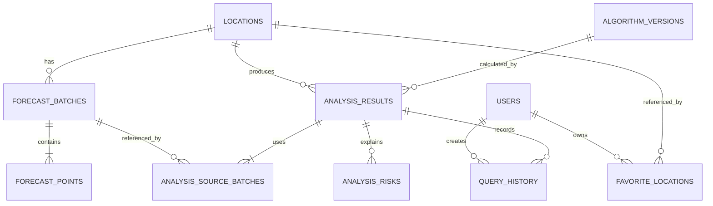

# 数据库设计

## 1. 设计目标

- 支持逐小时预报和分析结果的可追溯、可重算与历史对比。
- 将用户数据、算法版本和外部 Provider 调用记录清晰分离。
- 在 PostgreSQL 上满足查询性能，在 SQLite 本地开发模式保持基本兼容。
- 缓存不是事实来源，Redis 丢失后可从数据库或 Provider 恢复。

## 2. 数据库选型

| 环境 | 方案 | 说明 |
| --- | --- | --- |
| 生产 | PostgreSQL 16+ | 主数据、时序预报、分析、用户和审计 |
| 本地开发 | SQLite | 降低启动成本，不作为生产容量基准 |
| 缓存 | Redis 7+（可选） | 短期预报、分析响应、分布式锁 |

EF Core 负责模型映射和迁移。涉及 Provider 特有 SQL、索引或精度时，应建立 PostgreSQL 集成测试，不能仅依赖 SQLite。

## 3. 概念模型

## 4. 核心表

### 4.1 `locations`

| 字段 | PostgreSQL 类型 | 可空 | 说明 |
| --- | --- | --- | --- |
| `id` | uuid | 否 | 主键 |
| `normalized_name` | varchar(160) | 否 | 规范名称 |
| `display_name` | varchar(200) | 否 | 展示名称 |
| `latitude` | numeric(9,6) | 否 | 纬度 |
| `longitude` | numeric(9,6) | 否 | 经度 |
| `time_zone_id` | varchar(64) | 否 | IANA 时区 |
| `location_type` | smallint | 否 | 海岛、港口、坐标点等 |
| `coast_orientation_deg` | numeric(6,2) | 是 | 可选岸线外法线方向 |
| `is_preset` | boolean | 否 | 是否系统预置 |
| `created_at` | timestamptz | 否 | 创建时间 |

唯一约束：预置地点的 `normalized_name + latitude + longitude` 唯一。

### 4.2 `forecast_batches`

| 字段 | 类型 | 可空 | 说明 |
| --- | --- | --- | --- |
| `id` | uuid | 否 | 批次主键 |
| `location_id` | uuid | 否 | 地点 |
| `provider_code` | varchar(40) | 否 | Provider 标识 |
| `data_domain` | smallint | 否 | Weather/Marine/Tide/Observation |
| `endpoint_code` | varchar(60) | 是 | Weather、Marine、Tide 或文件产品标识 |
| `model_code` | varchar(40) | 是 | ECMWF/GFS 等模型标识 |
| `issued_at` | timestamptz | 是 | 模型发布时间 |
| `fetched_at` | timestamptz | 否 | 系统抓取时间 |
| `range_start/end` | timestamptz | 否 | 覆盖范围 |
| `quality_status` | smallint | 否 | Valid/Partial/Stale/Invalid |
| `freshness` | smallint | 否 | Fresh/Stale/Expired/Unknown |
| `quality_flags` | integer | 否 | 批次级质量位图 |
| `completeness` | double precision | 否 | 批次完整度 `[0, 1]` |
| `raw_payload_hash` | char(64) | 是 | 原始响应摘要，用于去重和追溯 |

批次采用追加写，不允许更新既有点位内容。

Application 通过 `IForecastBatchRepository` 追加批次时显式传入 `location_id`，Infrastructure 负责将领域批次、点位和指标来源引用映射为一棵 EF 图。读取按地点、Provider、数据域和 Provider 模型筛选，并要求批次覆盖请求的 UTC 范围；请求范围仅允许 24、72 或 168 小时。SQLite 对 `DateTimeOffset` 的有序比较不支持服务端翻译，因此本地测试路径先按身份字段读取候选，再执行 UTC 覆盖判断；PostgreSQL 使用数据库端范围谓词。

### 4.3 `forecast_points`

| 字段组 | 主要字段 | 说明 |
| --- | --- | --- |
| 标识 | `id`, `batch_id`, `forecast_time` | 批次内时间唯一 |
| 风 | `wind_speed_ms`, `wind_gust_ms`, `wind_direction_deg` | 可空标准值 |
| 浪 | `wave_height_m`, `wave_period_s`, `wave_direction_deg` | 有效波高及方向 |
| 风浪 | `wind_wave_height_m`, `wind_wave_period_s`, `wind_wave_direction_deg` | Open-Meteo Marine 等来源的本地风浪分量 |
| 涌浪 | `swell_height_m`, `swell_period_s`, `swell_direction_deg` | 主涌浪；次涌浪后续扩展 |
| 对流 | `precipitation_mm`, `cape_jkg`, `thunderstorm` | 雷暴允许未知 |
| 环境 | `visibility_m`, `temperature_c`, `humidity_percent`, `pressure_hpa`, `cloud_cover_percent` | 可空 |
| 海洋增强 | `sea_temperature_c`, `current_speed_ms`, `current_direction_deg` | Stormglass 或后续海洋源 |
| 潮汐 | `tide_height_m`, `tide_type` | WorldTides 逐时潮位；高潮/低潮极值可使用详情 JSON 或独立扩展表 |
| 质量 | `missing_mask`, `quality_flags` | 缺失位图与异常标记 |

数值列保留足够精度但避免无意义高精度；方向统一为 `[0, 360)`。

### 4.4 `forecast_point_sources`

当组装快照选择多个来源批次时，逐指标保存来源引用，避免只依赖预报点所在批次推断来源。该表与 `forecast_points` 使用 `forecast_point_id + metric` 联合主键。

| 字段 | 类型 | 可空 | 说明 |
| --- | --- | --- | --- |
| `forecast_point_id` | uuid | 否 | 预报点 |
| `metric` | smallint | 否 | 标准指标枚举 |
| `provider_code` | varchar(40) | 否 | Provider 标识 |
| `source_model` | varchar(80) | 否 | 实际底层模型 |
| `batch_id` | uuid | 否 | 来源批次 |
| `forecast_time` | timestamptz | 否 | 来源指标对应的 UTC 时间 |
| `quality_status` | smallint | 否 | 指标质量状态 |
| `freshness` | smallint | 否 | Fresh/Stale/Expired/Unknown |
| `quality_flags` | integer | 否 | 指标级异常与降级位图 |

`missing_mask` 以 `ForecastMetricName` 枚举位保存。批次级 `DataQuality.MissingMetrics` 在读取时由该批次所有点位的缺失位集合并恢复；原始字段为空仍保持为空，不使用 0 代替。

### 4.5 `analysis_results`

| 字段 | 类型 | 说明 |
| --- | --- | --- |
| `id` | uuid | 主键 |
| `location_id` | uuid | 地点 |
| `algorithm_version_id` | uuid | 算法版本 |
| `source_set_hash` | char(64) | 分析所用批次集合及选择策略摘要 |
| `activity_type` | smallint | 综合或具体活动 |
| `range_start/end` | timestamptz | 分析范围 |
| `score` | numeric(5,2) | 0-100；Unknown 时可空 |
| `risk_level` | smallint | VeryGood/Good/Moderate/Caution/Avoid/Unknown |
| `confidence` | numeric(4,3) | 0-1 |
| `recommended_start/end` | timestamptz | 可空推荐窗口 |
| `return_before` | timestamptz | 可空返航建议 |
| `summary_template_code` | varchar(80) | 规则摘要模板 |
| `created_at` | timestamptz | 创建时间 |

### 4.6 `analysis_source_batches`

| 字段 | 类型 | 说明 |
| --- | --- | --- |
| `analysis_result_id` | uuid | 所属分析结果 |
| `forecast_batch_id` | uuid | Weather/Marine/Tide/Observation 批次 |
| `source_role` | smallint | Primary/Enhancement/Fallback/Validation |
| `metric_scope` | varchar(200) | 该批次实际贡献的指标集合摘要 |
| `selection_policy` | varchar(80) | Primary、Conservative、ExplicitModel 等策略 |

联合主键：`analysis_result_id + forecast_batch_id + source_role`。同一分析可引用 Open-Meteo Weather、Open-Meteo Marine 和 WorldTides 等多个批次。

### 4.7 `analysis_risks`

| 字段 | 类型 | 说明 |
| --- | --- | --- |
| `id` | uuid | 主键 |
| `analysis_result_id` | uuid | 所属结果 |
| `forecast_time` | timestamptz | 风险时间 |
| `rule_code` | varchar(64) | 稳定规则代码 |
| `severity` | smallint | Info/Warning/High/Critical |
| `actual_value` | numeric(12,4) | 可空实际值 |
| `threshold_value` | numeric(12,4) | 可空阈值 |
| `penalty` | numeric(6,2) | 扣分 |
| `details_json` | jsonb | 多指标组合说明 |

### 4.8 用户和配置表

- ASP.NET Core Identity 的 `users`/角色/令牌表。
- `favorite_locations`：`user_id + location_id` 唯一，包含默认活动、备注和排序。
- `query_history`：用户、查询条件、分析结果和时间；按保留策略清理。
- `user_settings`：单位、默认活动、时区和通知偏好。
- `algorithm_versions`：版本号、状态、参数 JSON、校验摘要、发布人与时间。
- `provider_call_logs`：Provider、耗时、状态、缓存、配额头和错误分类，不保存密钥。
- `audit_logs`：管理配置和算法发布的前后差异摘要。

## 5. 索引设计

| 表 | 索引字段 | 类型 | 场景 |
| --- | --- | --- | --- |
| `locations` | `normalized_name` | btree / trigram 可选 | 地名搜索 |
| `forecast_batches` | `location_id, fetched_at desc` | btree | 最新批次 |
| `forecast_batches` | `provider_code, data_domain, model_code, location_id, issued_at, range_start` | unique/partial | 分域批次去重 |
| `forecast_points` | `batch_id, forecast_time` | unique | 批次逐小时读取 |
| `analysis_results` | `location_id, created_at desc` | btree | 最近分析 |
| `analysis_results` | `source_set_hash, algorithm_version_id, activity_type` | btree | 相同来源集合重用结果 |
| `analysis_source_batches` | `forecast_batch_id, analysis_result_id` | btree | 来源反查和影响分析 |
| `analysis_risks` | `analysis_result_id, severity` | btree | 风险明细 |
| `query_history` | `user_id, created_at desc` | btree | 用户历史 |

## 6. 数据约束

- 所有业务主键使用 UUID；时间使用 `timestamptz`/`DateTimeOffset`。
- 百分比限制在 0-100，方向限制在 `[0, 360)`，分数限制在 0-100。
- 外键删除默认 `Restrict`；用户个人数据可按业务执行级联删除。
- `forecast_points` 的气象字段允许空值，禁止用 0 表示缺失。
- `analysis_results` 至少关联一个来源批次；每个风险事实引用的指标必须能映射到来源批次。
- 同一 `ForecastBatch` 只包含一个数据域，避免 Weather 与 Marine 的时间/质量状态相互覆盖。
- `algorithm_versions.parameters_json` 发布前必须通过 Schema 和领域边界校验。

## 7. 保留、分区与归档

- 逐小时预报默认保留 90 天，分析结果和用户历史默认保留 180 天，可配置。
- Provider 调用日志保留 30 天，审计日志至少保留 1 年。
- 数据量达到单表千万级前评估按 `forecast_time` 月分区，不在 MVP 过早引入。
- 原始响应默认只保留哈希；故障调试负载加密并短期保留不超过 7 天。

## 8. 迁移与版本管理

- 使用 EF Core Migration，迁移文件进入版本控制。
- 发布流水线先生成幂等 SQL 并评审，再由受限账号执行。
- 破坏性变更采用扩展-迁移-收缩流程，不依赖数据库迁移自动回滚。
- SQLite 与 PostgreSQL 均运行基础迁移测试，生产特性以 PostgreSQL 为准。

## 9. 备份与恢复

| 项目 | 目标 |
| --- | --- |
| 全量备份 | 每日一次，保留 14-30 天 |
| WAL/增量 | 生产按托管平台能力启用 |
| RPO | <= 24 小时；成熟后 <= 1 小时 |
| RTO | <= 4 小时 |
| 恢复演练 | 至少每季度一次，并验证应用可读取 |

## 10. 安全

- 应用账号仅拥有所需 Schema 的读写权限，迁移账号独立。
- 备份、连接字符串和原始调试负载加密保存。
- 精确位置、历史和用户标识按最小化原则存储，支持用户删除。
- 日志和 `provider_call_logs` 不保存 API Key、令牌和完整请求头。

## 11. 变更记录

| 版本 | 日期 | 变更说明 |
| --- | --- | --- |
| 1.0 | 2026-07-13 | 建立预报批次、分析可追溯和用户数据模型 |
| 1.1 | 2026-07-13 | 分析结果改为通过关联表引用多个 Weather/Marine/Tide 来源批次 |
| 1.2 | 2026-07-16 | 补充 ForecastBatch 仓储读写边界、质量字段和逐点缺失位恢复语义 |
