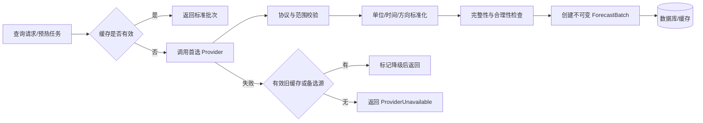

# 天气数据源设计

## 1. 目标与原则

系统优先尝试通过合法授权的 Windy API 获取天气和海洋预报，但不将 Windy 视为不可替换的唯一来源。所有 Provider 必须实现统一契约，并在接入前确认字段、区域覆盖、更新频率、配额、缓存权利和展示署名要求。

严禁抓取 Windy 网页、复用非公开接口或绕过供应商许可。

## 2. Provider 分层

| 层级 | 候选来源 | 用途 | v1.0 策略 |
| --- | --- | --- | --- |
| 天气/海浪主源 | Windy API | 风、阵风、浪、涌浪、降雨等 | 完成能力验证后启用 |
| 天气备选 | Open-Meteo 或其他合规 API | 主源缺失/故障时补充 | Provider 契约预留 |
| 潮汐 | 独立潮汐供应商 | 潮位、高潮、低潮 | 第二阶段 |
| 天文 | 本地算法或合规 API | 日出日落、月相 | 第二阶段 |
| 官方预警 | 目标区域官方源 | 高影响天气和海事预警 | 按地区逐步接入 |

接入顺序以“是否能提供所需字段并允许当前使用方式”为准，而不是以品牌优先。

## 3. Provider 契约

```csharp
public interface IMarineForecastProvider
{
    string ProviderCode { get; }

    Task<ProviderForecastResult> GetForecastAsync(
        GeoPoint location,
        ForecastRange range,
        CancellationToken cancellationToken);
}
```

`ProviderForecastResult` 仍属于 Infrastructure/Application 边界；通过 `IForecastNormalizer` 转换为领域 `ForecastBatch` 后才能进入分析引擎。

## 4. 标准指标映射

| 标准字段 | 单位 | 必需级别 | 说明 |
| --- | --- | --- | --- |
| `windSpeedMs` | m/s | P0 | 平均风速 |
| `windGustMs` | m/s | P0 | 阵风，缺失时不可按平均风估算为真实值 |
| `windDirectionDeg` | degree | P0 | 气象风向，统一来源/去向语义 |
| `waveHeightM` | m | P0 | 有效波高 |
| `wavePeriodS` | s | P0 | 代表性浪周期 |
| `waveDirectionDeg` | degree | P0 | 浪传播方向，映射时明确语义 |
| `swellHeightM` | m | P0/P1 | 主涌浪高度 |
| `swellPeriodS` | s | P0/P1 | 主涌浪周期 |
| `swellDirectionDeg` | degree | P1 | 主涌浪方向 |
| `precipitationMm` | mm/h | P1 | 必须记录积累周期 |
| `thunderstorm` | bool/unknown | P0 | 优先使用明确雷暴或官方预警 |
| `capeJkg` | J/kg | P1 | 只表示对流潜势，不单独证明雷暴 |
| `visibilityM` | m | P0 | 缺失时降低活动置信度 |
| `temperatureC` | C | P1 | 气温 |
| `humidityPercent` | % | P1 | 相对湿度 |
| `pressureHpa` | hPa | P1 | 海平面气压优先 |
| `cloudCoverPercent` | % | P1 | 摄影活动使用 |
| `seaTemperatureC` | C | P2 | 海水温度 |

## 5. 采集与标准化流程



## 6. 标准化规则

- 时间：解析 Provider 时区和发布时间后统一为 UTC；禁止假设所有时间为本地时间。
- 坐标：使用 WGS84，经纬度保留约 6 位小数；缓存键可按网格精度归一化。
- 风速：统一为 m/s；节、km/h 仅在展示层换算。
- 方向：统一为 `[0, 360)`，并在适配器测试中确认“来自方向”还是“传播方向”。
- 降水：记录值和累积窗口，不能混用 mm、mm/h 和多小时总量。
- 空值：Provider 缺失、无此能力和解析失败分别记录质量标记。

## 7. 数据质量

| 检查项 | 示例规则 | 异常处理 |
| --- | --- | --- |
| 完整性 | P0 指标覆盖率 | 降低置信度；严重时拒绝评分 |
| 时效性 | `now - fetchedAt` 与模型更新周期比较 | 标记 Fresh/Stale/Expired |
| 合理性 | 风速、浪高、湿度等物理范围 | 单点标 Invalid，不自动改成边界值 |
| 时间连续性 | 预报时间升序且无重复 | 去重；缺口显式保留 |
| 一致性 | 阵风通常不低于平均风、方向范围正确 | 标记 Suspicious，进入质量说明 |

质量状态：`Valid`、`Partial`、`Stale`、`Invalid`。分析置信度使用指标级质量，而不是只看批次总体状态。

## 8. 多数据源策略

v1.0 默认选择单一批次进行分析，不在没有验证的情况下混合不同模型。后续多源能力按以下方式演进：

1. 并排展示模型差异。
2. 对关键指标计算分歧范围并降低置信度。
3. 只有经过历史样本验证后，才引入加权融合。

不同 Provider 冲突时不使用简单平均掩盖极端值；安全相关场景可采用更保守值或提示模型分歧。

## 9. 韧性策略

- 连接超时 2 秒、总请求超时 5 秒作为初始值，按 Provider SLA 调整。
- 仅对超时、连接故障和明确可重试状态执行最多 2 次指数退避并加入抖动。
- `4xx` 参数/认证/配额错误默认不重试。
- 连续失败触发熔断；半开阶段只允许少量探测请求。
- 使用单航班锁避免同一地点和范围并发击穿 Provider 配额。

## 10. 配额、缓存与成本

- 预报缓存 TTL 初始为 10-30 分钟，但不得超过 Provider 授权的缓存期限。
- 缓存键包含 Provider、模型、坐标网格、时间范围和标准化版本。
- 记录配额响应头、调用次数、失败率和平均成本；达到阈值时优先服务缓存命中。
- 页面明确展示数据来源和必要署名。

## 11. 接入验收清单

- 已确认商业/个人使用许可、缓存和展示要求。
- P0 字段、时间分辨率和目标海域覆盖已通过真实坐标验证。
- 正常、空数据、限流、认证失败、超时和字段变化已有契约样本。
- 单位、方向、时间和降水窗口映射通过测试。
- 供应商故障时缓存降级和用户提示符合 SRS。

## 12. 变更记录

| 版本 | 日期 | 变更说明 |
| --- | --- | --- |
| 1.0 | 2026-07-13 | 明确 Windy 可插拔接入、标准字段和质量治理 |
