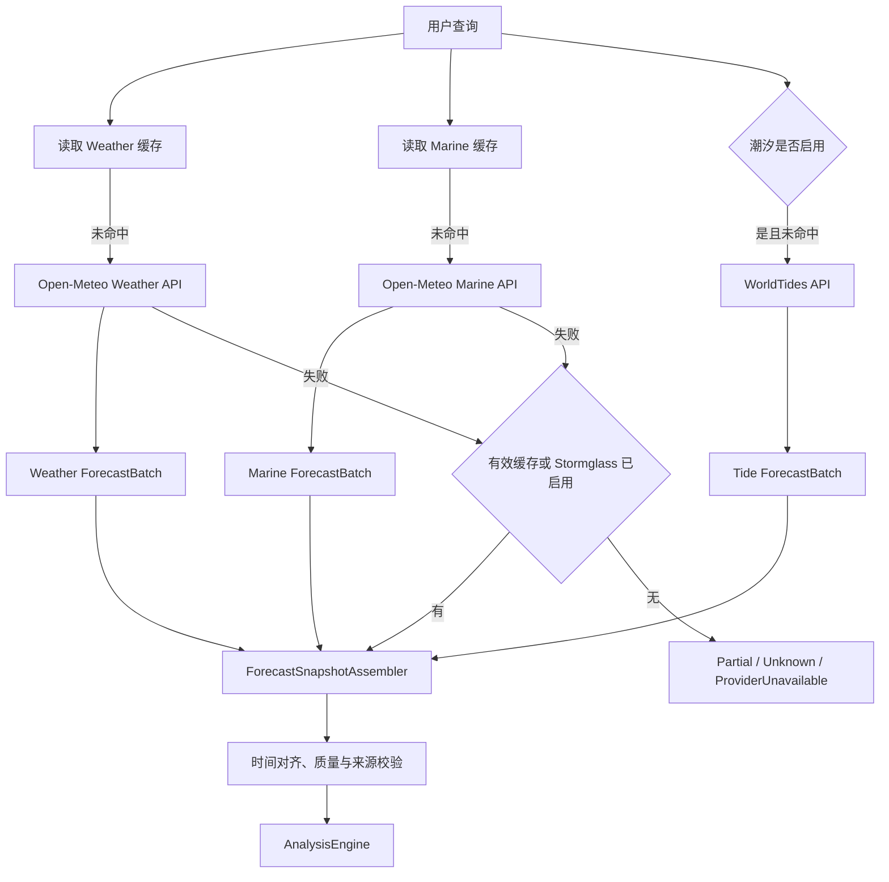

# 天气数据源设计

## 1. 选型结论

Windy API 因价格过高，不再作为 Marine Insight 的候选数据源。当前采用分层 Provider 策略：

1. **MVP 默认主源：Open-Meteo**。Weather API 提供常规天气，Marine API 提供有效波高、风浪、涌浪及对应周期和方向。
2. **专业增强：Stormglass.io**。默认关闭，用于海面温度、洋流、潮汐、多来源模型交叉比对或 Open-Meteo 关键字段不足的付费场景。
3. **长期免费方案：NOAA/NCEP + NDBC**。NOAA/NCEP 的 WaveWatch III 等模型文件用于未来离线预处理；NDBC 浮标观测用于校准和验证，不直接当作全球预报替代品。
4. **潮汐补充：WorldTides**。作为独立 `ITideProvider`，按需获取高潮、低潮、潮位曲线和极端潮汐信息。

Provider 选择由数据能力、目标海域覆盖、许可、成本和维护复杂度共同决定。系统禁止抓取第三方网页或绕过服务条款。

## 2. 价格与配额调研快照

以下内容是 **2026-07-13 的方案调研快照**，只用于架构和预算决策。价格、免费额度、非商业限制、缓存权利及署名要求可能随时变化，采购或上线前必须以各供应商官方页面和合同为准。

| 数据源 | 调研价格/额度 | 定位 | 当前决策 |
| --- | --- | --- | --- |
| Open-Meteo | 非商业开放接口约 10,000 次/日且通常无需 Key；商业方案约 30 欧元/月、约 100,000 次/日 | 高性价比天气与海浪主源 | MVP 默认启用 |
| Stormglass.io | 免费层约 10 次/日；基础商业版约 59 美元/月 | 航海、冲浪、渔业专业增强 | 默认关闭，按预算启用 |
| NOAA/NCEP/NDBC | 公共数据通常免费 | 原始模型文件和实测浮标数据 | v2.0 研究路线 |
| WorldTides | Credit 预付费，调研示例约 15 美元购买一批调用额度 | 全球潮汐专用服务 | P1 按需启用 |

调用次数不能直接等同于用户查询次数。一次用户查询可能同时调用 Weather、Marine、Tide 等多个端点；容量评估必须按实际外部请求数计算。

## 3. 能力矩阵

| 能力 | Open-Meteo | Stormglass | NOAA/NCEP | NDBC | WorldTides |
| --- | --- | --- | --- | --- | --- |
| 常规天气、风、阵风、降水 | Weather API | 支持 | 部分模型支持 | 实测站点 | 不支持 |
| 有效波高、周期、方向 | Marine API | 支持 | WW3 等模型 | 实测站点 | 不支持 |
| 风浪与涌浪分量 | Marine API | 支持，多来源字段较细 | WW3 文件需解析 | 部分站点 | 不支持 |
| 海面温度 | 接入前按目标模型实测 | 支持 | 需选其他海洋数据集 | 部分站点 | 不支持 |
| 洋流速度与方向 | 接入前按目标模型实测 | 支持 | 非 WW3 核心能力，需独立数据集 | 部分站点 | 不支持 |
| 高低潮与潮位 | 非 MVP 依赖 | 支持 | 需独立潮汐数据 | 观测不等同全球预测 | 核心能力 |
| 多模型/多机构对比 | 可选择底层模型，但需分别请求和验证 | 单次响应可包含多个来源 | 直接使用指定模型 | 观测校准 | 不适用 |
| 接入难度 | 低，REST JSON | 中，REST JSON 和来源选择 | 高，GRIB2/NetCDF | 中，站点与格式差异 | 低，REST JSON |

Open-Meteo 可以提供 ECMWF、GFS 等底层模型，但这不意味着其结果与其他展示平台“完全一样”。插值方式、更新时间、模型版本、变量可用性和后处理均可能不同，页面必须展示实际 Provider 和模型标识。

## 4. v1.0 Provider 组合

### 4.1 Open-Meteo Weather Provider

负责：

- 平均风速、阵风、风向。
- 温度、湿度、气压、降水、云量、能见度。
- CAPE、天气代码以及可用于判断对流风险的字段。

雷暴结论不能只依赖 CAPE。应结合天气代码、降水/对流信号及后续官方预警 Provider；字段缺失时保持 `Unknown`。

### 4.2 Open-Meteo Marine Provider

负责按目标模型实际可用字段获取：

- 有效波高、浪向、浪周期。
- 风浪高度、方向、周期和峰值周期。
- 涌浪高度、方向、周期和峰值周期。

Weather API 与 Marine API 分别保存为不可变 `ForecastBatch`。系统按 UTC 时间轴合并为分析快照，不把两个端点伪装成单个原始响应。

### 4.3 Stormglass Provider

Stormglass 默认配置为 `Enabled=false`，适用场景：

- 需要海面温度、洋流或更完整潮汐字段。
- 需要 NOAA、MeteoFrance、UK Met 等来源的交叉比对。
- Open-Meteo 在目标海域缺少关键字段，并且项目有明确调用预算。

Stormglass 返回多个来源时，必须保留来源维度。v1.0 不使用无验证的简单平均；可选择明确模型、并排展示分歧或按保守规则取值。

### 4.4 WorldTides Provider

WorldTides 与天气/海浪 Provider 分离，输出潮汐预测批次：

- 高潮、低潮时间和预测潮位。
- 逐时潮位曲线和潮汐极值。
- 调用产生的 Credit 消耗和剩余额度摘要。

潮汐预测适合长 TTL 缓存。同一地点和预测日期不得因页面刷新重复消耗 Credit。

### 4.5 NOAA/NCEP 与 NDBC

- NOAA/NCEP 的 WW3 等预报通常通过 GRIB2/NetCDF 文件分发，适合后台定时下载、解码、网格裁剪和内部对象存储，不适合用户请求时现场解析大文件。
- 可评估 ECMWF ecCodes/GRIB API 的 .NET 封装、GribApi.NET，或使用 Python `xarray/cfgrib` 预处理后输出内部 Parquet/JSON。技术选型前必须检查库的维护状态、平台兼容性和许可证。
- NDBC 主要提供浮标和站点观测。观测数据用于验证浪高、周期、风和海温偏差，不能覆盖没有站点的全球海域。
- 该方案进入 v2.0，不阻塞 MVP，也不作为在线请求的自动 fallback。

## 5. Provider 契约

不同数据域使用独立端口，避免一个接口被天气、海浪和潮汐的差异拖成巨型 DTO：

```csharp
public interface IWeatherForecastProvider
{
    string ProviderCode { get; }

    Task<ProviderForecastResult> GetWeatherAsync(
        GeoPoint location,
        ForecastRange range,
        CancellationToken cancellationToken);
}

public interface IMarineForecastProvider
{
    string ProviderCode { get; }

    Task<ProviderForecastResult> GetMarineAsync(
        GeoPoint location,
        ForecastRange range,
        CancellationToken cancellationToken);
}

public interface ITideProvider
{
    string ProviderCode { get; }

    Task<ProviderTideResult> GetTidesAsync(
        GeoPoint location,
        ForecastRange range,
        CancellationToken cancellationToken);
}
```

Provider 结果经各自 Normalizer 转换为独立批次，再由 `ForecastSnapshotAssembler` 按地点、时间、数据域和来源策略组装分析输入。

## 6. 标准指标映射

| 标准字段 | 单位 | 默认来源 | 必需级别 |
| --- | --- | --- | --- |
| `windSpeedMs` | m/s | Open-Meteo Weather | P0 |
| `windGustMs` | m/s | Open-Meteo Weather | P0 |
| `windDirectionDeg` | degree | Open-Meteo Weather | P0 |
| `waveHeightM` | m | Open-Meteo Marine | P0 |
| `wavePeriodS` | s | Open-Meteo Marine | P0 |
| `waveDirectionDeg` | degree | Open-Meteo Marine | P0 |
| `windWaveHeightM` | m | Open-Meteo Marine | P1 |
| `windWavePeriodS` | s | Open-Meteo Marine | P1 |
| `swellHeightM` | m | Open-Meteo Marine | P0/P1 |
| `swellPeriodS` | s | Open-Meteo Marine | P0/P1 |
| `swellDirectionDeg` | degree | Open-Meteo Marine | P1 |
| `precipitationMm` | mm/h | Open-Meteo Weather | P1 |
| `capeJkg` | J/kg | Open-Meteo Weather | P1 |
| `visibilityM` | m | Open-Meteo Weather | P0 |
| `seaTemperatureC` | C | Stormglass/后续海洋源 | P2 |
| `currentSpeedMs` / `currentDirectionDeg` | m/s / degree | Stormglass/后续海洋源 | P2 |
| `tideHeightM` / `tideType` | m / enum | WorldTides | P1 |

任一字段必须携带 `providerCode`、`sourceModel`、`batchId`、`forecastTime` 和质量标记。合并快照中的不同指标允许来自不同批次，但不能丢失来源。

## 7. 获取与组装流程



Weather 和 Marine 请求可以并行执行，但必须分别应用超时、缓存和故障状态。潮汐失败不应阻断不依赖潮汐的基础海况分析。

## 8. 标准化与时间对齐

- 所有时间转换为 UTC，按分析时间粒度对齐；原始发布时间和时间分辨率单独保存。
- 只有在允许的最大时间差内才做最近点匹配，禁止跨越过大缺口填充。
- 坐标使用 WGS84；Provider 实际使用的网格点坐标应保留，便于解释近岸误差。
- 风速统一为 m/s，浪高/潮位统一为 m，周期统一为 s，方向统一为 `[0, 360)`。
- 明确方向字段是“来自方向”还是“传播方向”，在 Normalizer 契约测试中验证。
- Provider 缺失、模型无此变量、接口失败和解析失败使用不同质量标记。
- 多来源同名指标禁止静默覆盖；选择策略和被舍弃来源必须可观测。

## 9. 路由与降级策略

| 场景 | 策略 |
| --- | --- |
| Open-Meteo Weather/Marine 正常 | 使用两个独立批次组装快照 |
| 单个 Open-Meteo 端点失败但有有效缓存 | 使用缓存并标记 Stale 和实际年龄 |
| 关键端点失败且 Stormglass 已启用、有预算 | 调用 Stormglass，保留 Provider 切换说明 |
| 关键端点失败且无替代 | 基于剩余字段返回 Partial/Unknown，必要时 503 |
| WorldTides 失败 | 基础海况继续，潮汐相关活动降低置信度或不评分 |
| NOAA 文件管线中断 | 不影响 v1.x 在线查询，记录后台任务告警 |
| Stormglass 多模型分歧大 | 显示分歧并降低置信度，不做简单平均 |

自动 fallback 必须受 `ProviderRoutingPolicy`、日/月预算、调用余量和功能开关控制，避免一次主源故障造成不可控付费调用。

## 10. 缓存与成本控制

- Open-Meteo Weather 与 Marine 使用独立 Key 和 TTL，TTL 结合模型更新频率和服务条款设置。
- WorldTides 按地点网格 + 日期范围缓存，TTL 可为 6-24 小时；极端潮汐预警按更短周期刷新。
- Stormglass 设置每日调用硬上限、每用户/每地点预算和熔断开关，默认不参与匿名查询自动回源。
- NOAA 文件按模型运行批次下载一次，再服务多个地点，避免逐用户重复获取大文件。
- 监控外部调用数、用户查询到外部调用放大倍数、缓存命中、Credit/配额和月度预估成本。
- 达到预算阈值时优先使用有效缓存并关闭付费增强，不影响 Open-Meteo 基础查询。

## 11. 数据质量与多模型原则

| 检查项 | 规则 | 异常处理 |
| --- | --- | --- |
| 完整性 | P0 字段按数据域计算覆盖率 | 降低置信度，严重时 Unknown |
| 时效性 | 各批次独立判断 Fresh/Stale/Expired | 不能用新 Weather 时间掩盖旧 Marine 数据 |
| 时间连续性 | 逐小时升序、无重复且缺口明确 | 不跨长缺口插值 |
| 空间代表性 | 保留 Provider 网格点和目标点距离 | 近岸距离过大时提示不确定性 |
| 模型一致性 | 比较来源差异和更新时间 | 分歧大时展示范围并保守处理 |
| 合理性 | 物理范围、阵风/平均风等关系 | 标记 Invalid/Suspicious，不自动改 0 |

多模型能力按“先并排、再评估、后融合”演进。没有历史验证前，不对 ECMWF、GFS 等模型做固定权重平均。

## 12. 接入验收清单

### Open-Meteo

- Weather 和 Marine API 在东极岛、舟山、南麂岛等代表坐标返回所需时间范围。
- 已验证 P0 变量名称、单位、时间分辨率、目标网格点和底层模型标识。
- 已确认当前使用场景属于非商业还是商业，并记录官方配额和署名要求。
- 两个端点的时间轴合并、缺失值、限流和服务故障有契约测试。

### Stormglass

- 已明确要购买的能力、来源选择策略、每日预算和自动 fallback 开关。
- 多来源字段解析不会把不同模型静默平均或覆盖。
- 免费调试额度只用于少量契约测试，不用于 CI 高频调用。

### WorldTides

- 已验证目标海岛的潮位、极值时间、时区和基准面说明。
- 已启用 Credit 余额告警、长 TTL 缓存和无潮汐降级。

### NOAA/NDBC

- 已用固定 GRIB2/NetCDF 文件验证解码、网格定位和资源消耗。
- 已区分模型预报与浮标观测，并建立站点/时间匹配规则。
- 文件解析只在后台管线执行，不进入用户请求热路径。

## 14. 当前 Open-Meteo 实现约定

- `OpenMeteoWeatherProvider` 和 `OpenMeteoMarineProvider` 位于 Infrastructure 的 Open-Meteo Provider 目录，分别实现 `IWeatherForecastProvider` 和 `IMarineForecastProvider`。
- Weather 请求显式指定 m/s、摄氏度、mm 和 UTC；Marine 使用 API 的公制默认单位。Weather 的 `precipitation` 是前一小时降水量，按逐小时结果映射为 `precipitationMmPerHour`，不进行额外累计。
- 请求使用 UTC 日期范围并在收到响应后再次按 `ForecastRange` 过滤；所有返回时间统一为 UTC。响应中的 `latitude`/`longitude` 保存为 `ForecastBatch.GridLocation`，不覆盖用户请求坐标。
- `model` 优先使用响应中的实际模型标识，响应未提供时保留配置的请求模型。Weather 与 Marine 始终生成独立批次，后续才允许按 UTC 时间轴组装。
- Open-Meteo `best_match` 当前可能为 `wave_peak_period`、`wind_wave_peak_period` 和 `swell_wave_peak_period` 返回合法 `null`。这三个峰值周期指标属于可选增强：缺失时不标记 `MissingMetric`、不计入 `Partial` 完整性、也不影响评分；有值时照常记录到快照，禁止用 0 补齐。
- 数组长度不一致、时间缺失/重复/非递增、网格坐标非法和非法 JSON 抛出 `ProviderContractException`；401/403、429、超时/连接失败、5xx 分别映射到认证、限流、超时或暂时不可用异常。Provider API Key 只通过配置注入，不写入日志或错误消息。
- 单个值为 `null` 时保留缺失语义；负数、越界百分比、非法方向或其他物理范围异常标记 `InvalidValue` 并清空该值。方向 360 度标准化为 0 度，其余有效值保持在 `[0, 360)`。
- `thunderstorm` 仅由 WMO `weather_code` 95/96/99 明确映射；CAPE 不单独推导雷暴结论，天气代码缺失时保持 Unknown。
- `ForecastSnapshotAssembler` 位于 Application：以每个数据域选定的一个批次为输入，按请求范围内的 UTC 时间并集生成快照点。默认只接受 30 分钟内的最近点；近似对齐会标记 `TimeGap`/`Partial`，超出上限的源域保留为缺失，不插值、不补 0。
- 同一数据域存在多个 Provider 时必须配置 `PreferredBatchProviders`；合并后同一指标出现多个候选时必须配置 `PreferredMetricProviders`，否则抛出选择策略错误，禁止静默覆盖。
- 快照点的指标值来自选定批次，`MetricSource` 保留原始批次 ID、Provider、模型和实际预报时间；天气/海况/潮汐批次的时效和质量按源域合并，较旧或较弱质量不能被其他新批次掩盖。

2026-07-16 使用东极岛代表坐标执行了只读真实接口核对：Weather 所需变量和单位可返回；Marine 有效波高、周期、方向、风浪和涌浪可返回，峰值周期在 `best_match` 下为 `null`，按上述质量规则处理。

`MI-0027` 已实现可配置 `WorldTidesProvider`：默认关闭，启用时必须从 Secret 注入 API Key；请求按坐标四位网格和精确 UTC 起止小时使用 1-48 小时长 TTL 缓存，避免同日不同时段错误复用已裁剪批次。潮位统一为米和 Unix UTC 时间，30 分钟内最近极值映射为高潮/低潮；401/403、429、超时、协议错误和 Credit 耗尽分别映射 Provider 错误。低于 `CreditWarningThreshold` 时保留潮汐数据并返回 `degraded`，接口失败或未配置时基础分析继续。固定契约样本不含真实密钥；本地 Key 已通过 User Secrets 配置，尚未执行会消耗 Credit 的真实联调。

## 15. 变更记录

| 版本 | 日期 | 变更说明 |
| --- | --- | --- |
| 1.0 | 2026-07-13 | 建立可插拔数据源、标准字段和质量治理 |
| 1.1 | 2026-07-13 | 放弃 Windy，采用 Open-Meteo 主源、Stormglass 增强、WorldTides 潮汐和 NOAA/NDBC 长期方案 |
| 1.2 | 2026-07-16 | 实现 Open-Meteo Weather/Marine Provider、UTC/单位/质量标准化、异常映射和真实接口契约核对 |
| 1.3 | 2026-07-16 | 落地 ForecastSnapshotAssembler 的 UTC 时间轴、最大对齐误差和显式来源选择策略 |
| 1.4 | 2026-08-13 | 实现 WorldTides UTC 标准化、精确范围长缓存、Credit 告警和无潮汐降级 |
| 1.5 | 2026-08-13 | 峰值周期指标降级为可选增强，缺失不计入完整性/缺失指标 |
| 1.6 | 2026-08-19 | 新增天地图逆地理编码 Provider（`MI-0040`）：`TiandituReverseGeocoder` 服务端调用 `/geocoder?type=geocode` 反查最近地名，`Map:Tianditu:Key` 复用浏览器端瓦片 Key（key-per-file Secret），超时/HTTP 失败/`status!=0`/空地址一律返回 `null`（Best-effort） |
| 1.7 | 2026-08-19 | 天地图逆地理编码双 Key 拆分（`MI-0040` 跟进）：实测浏览器端 Key 调 `/geocoder` 返回 `301012 Key权限类型为:浏览器端`、服务端 Key 调 WMTS 瓦片返回 403，故逆地理编码改用独立 `Map:Tianditu:ServerKey`（`Map__Tianditu__ServerKey` key-per-file Secret），浏览器瓦片仍用 `Map:Tianditu:Key`；任一 Key 缺失均按设计 Best-effort 降级（反查 `null` / 瓦片由前端提示） |
