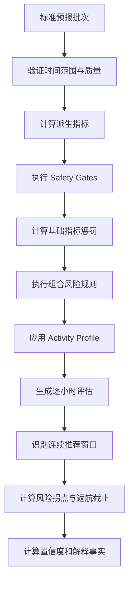

# 海况分析引擎设计

## 1. 设计目标

分析引擎将标准化逐小时预报转换为稳定、可测试、可解释的风险判断。它必须优先发现低频高影响风险，支持不同活动的风险差异，并在数据不足时明确返回不确定性。

## 2. 输入与输出

输入：

- `ForecastSnapshot`：由 Weather、Marine、Tide 等独立批次按时间组装的逐小时标准预报、指标来源和质量状态。
- `LocationContext`：坐标、时区和可选岸线朝向。
- `ActivityProfile`：活动指标权重、硬性规则和最低可接受分数。
- `AlgorithmVersion`：阈值、惩罚、组合规则和窗口参数。

输出 `AnalysisReport`：

- 每小时综合分、活动分和风险等级。
- 硬性风险、扣分项、实际值和规则代码。
- 推荐活动窗口、风险拐点和返航截止。
- 数据完整性、时效性、来源和置信度。
- 可供模板/AI 使用的结构化事实摘要。

## 3. 分析流水线



## 4. 派生指标

| 指标 | 计算 | 用途 |
| --- | --- | --- |
| 阵风比 | `gust / max(wind, epsilon)`，低风速时单独处理 | 识别突发风风险 |
| 风浪暴露角 | 风/浪方向与岸线外法线夹角 | 判断迎风、背风和正面冲浪 |
| 浪陡度代理 | 由浪高与周期构造的保守代理值 | 识别短周期陡浪；非完整海洋工程模型 |
| 数据完整率 | 可用关键字段权重之和 | 计算置信度 |
| 数据年龄 | 当前时间与抓取/发布时间差 | 标记过期 |
| 风险趋势 | 相邻小时分数和关键指标变化率 | 推荐窗口和返航时点 |

## 5. Safety Gates

硬性规则优先于评分执行。初始规则包括：

- 明确雷暴、官方禁止出海或高影响天气预警。
- 平均风速 >= 13 m/s。
- 有效波高 >= 2.0 m。
- 阵风 >= 18 m/s。
- 能见度 < 0.5 km。
- P0 数据严重缺失或已超过最大可接受时效，返回 `Unknown` 而不是 `Avoid` 分数。

Safety Gate 参数必须版本化。触发后仍计算风险原因，但最终活动等级不得被其他指标提高。

## 6. 组合风险规则

### 6.1 风小浪大

当平均风较低但有效波高或涌浪较高时，产生 `WIND_LOW_WAVE_HIGH`。页面必须突出这是易被忽略的远洋或历史天气影响。

### 6.2 阵风异常

平均风不高但阵风绝对值或阵风比明显偏高时，提高露营、乘船、登岛和使用遮阳棚等活动风险。

### 6.3 短周期风浪

浪周期 < 5-6 秒且浪高达到关注阈值时，增加船体颠簸、码头靠泊和乘船舒适度惩罚。

### 6.4 长周期涌浪

长周期并不等于统一“舒适”：

- 对离岸船只，浪峰间隔可能更长，但仍需结合浪高和船型。
- 对礁石、岸边、浮潜和登岛，长周期涌浪可能携带更大能量并产生突然上冲，使用额外风险修正。
- 当岸线朝向未知时，保守提示风险，不声称背风或背浪。

### 6.5 雷暴潜势

CAPE 只作为潜势指标。雷暴布尔值、官方预警和降水对流信息优先；高 CAPE 与其他对流信号共同出现时提高严重度。

## 7. 活动配置

| 活动 | 高关注指标 | 特有规则 |
| --- | --- | --- |
| 岸钓/矶钓 | 浪高、涌浪周期、浪向、潮汐 | 长周期涌浪和正面拍岸加重 |
| 船钓/乘船 | 风、阵风、浪高、短周期、能见度 | 颠簸和返航趋势加重 |
| 登岛/码头 | 浪高、浪向、阵风、能见度 | 靠泊时段连续性要求更高 |
| 露营 | 阵风、降雨、雷暴、温度 | 阵风比和夜间雷暴加重 |
| 摄影 | 能见度、云量、降水、风、日出日落 | 安全 Gate 保持一致，体验指标单独评分 |

浮潜和游泳需要潮汐、洋流、离岸流及现场管理信息，未具备这些数据前只提供有限参考，不给出“安全适宜”结论。

## 8. 时间窗算法

1. 按活动最低分、硬性风险和置信度筛出候选小时。
2. 合并连续候选小时，短暂单小时好转默认不形成推荐窗口。
3. 推荐窗口最短持续时间默认 2 小时，可按活动配置。
4. 检查窗口结束后的风、阵风、浪和雷暴趋势。
5. 返航截止 = 风险拐点 - 活动缓冲时间；船类默认缓冲大于岸上活动。
6. 若未来数据不足或风险波动过大，只展示趋势，不生成确定返航时间。

## 9. 置信度

置信度由以下因素共同决定：

- P0/P1 指标完整度。
- 各来源批次的数据抓取时间和模型发布时间；不能只使用最新批次代表整体时效性。
- 时间序列连续性。
- Provider 质量状态。
- 后续多模型版本中的模型分歧。

建议等级：`High >= 0.85`、`Medium 0.65-0.84`、`Low < 0.65`。低置信度时页面必须显示原因，严重不足时返回 `Unknown`。

## 10. 可解释输出

每条风险包含稳定规则代码、严重度、实际指标、阈值、扣分、受影响活动和用户文本模板。例如：

```text
规则：SWELL_LONG_PERIOD_SHORE
事实：涌浪 0.9 m，周期 12 s
影响：岸钓、登岛
说明：长周期涌浪可能造成突然拍岸，请远离湿滑礁石边缘。
```

## 11. 扩展点

- 新活动通过 `ActivityProfile` 增加，不复制整套引擎。
- 新 Provider 只改变标准化和质量输入。
- 潮汐、洋流、岸线与航线分析作为新的规则维度插入。
- 算法版本可以并行回放历史样本，验证后再发布。

## 12. 变更记录

| 版本 | 日期 | 变更说明 |
| --- | --- | --- |
| 1.0 | 2026-07-13 | 建立安全 Gate、组合风险、活动配置和时间窗流程 |
| 1.1 | 2026-07-13 | 分析输入调整为可追溯多来源 ForecastSnapshot |
