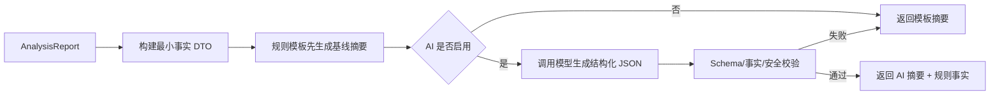

# AI 分析引擎设计

## 1. 目标与边界

AI 的职责是把确定性分析结果转为简洁、自然、适合普通用户阅读的说明。AI 不读取原始 Provider 响应，不自行计算分数，不预测规则之外的天气，也不得覆盖硬性风险、推荐窗口和返航截止。

AI 是 P1 可选能力。关闭或失败时，系统必须使用规则模板提供完整可用的核心结论。

## 2. 使用场景

| 场景 | 输入 | 输出 | 风险控制 |
| --- | --- | --- | --- |
| 当前海况摘要 | 指标事实、分数、风险 | 2-4 句摘要 | 只允许引用输入事实 |
| 活动建议解释 | 各活动评分和原因 | 分活动说明 | 不新增未计算活动 |
| 风险时间窗 | 风险趋势、推荐窗口 | 出发/返航说明 | 时间必须来自引擎 |
| 数据不确定性 | 缺失项、过期状态 | 降级说明 | 禁止补全缺失数据 |

## 3. 处理流程



## 4. 输入契约

仅传入必要字段：

- 地点展示名称和本地时间。
- 数据来源、更新时间、质量和置信度。
- 综合/活动分数与固定风险等级。
- 风险项的规则代码、实际值、阈值、严重度和时间。
- 引擎已经计算的推荐窗口和返航截止。
- 固定免责声明和受支持活动列表。

不传入 API Key、用户身份、精确历史轨迹、原始网页内容或未经清洗的用户文本。

## 5. 输出契约

```json
{
  "headline": "下午前海况总体适宜，但需关注长周期涌浪",
  "summary": "当前风速较低，浪高处于可接受范围。12 秒涌浪会增加礁石拍浪风险。",
  "activityNotes": [
    { "activity": "shoreFishing", "text": "建议远离湿滑礁石边缘。" }
  ],
  "riskWindowText": "预计 16:00 后风险上升，建议 15:30 前返航。",
  "uncertaintyText": null,
  "disclaimer": "结果仅供辅助决策，请以官方预警和现场管理为准。"
}
```

字段长度、活动枚举和时间文本必须校验。响应不得包含输入中不存在的数值、时间、地点或风险。

## 6. 提示词约束

系统提示词必须声明：

1. 你是海况分析结果的解释器，不是预报模型或安全责任主体。
2. 只能引用 JSON 中的事实，不得推断缺失值。
3. 不得提高评分、降低风险、删除硬性风险或改变时间窗。
4. 使用简洁中文，先说结论，再说最重要的 2-3 个原因。
5. 数据低置信度时优先说明不确定性。
6. 输出严格符合 JSON Schema，不使用 Markdown 星级替代结构字段。

提示词按 `promptVersion` 版本管理，和模型、参数、Schema 一同记录。

## 7. 事实校验

- 数值白名单：输出文本中出现的数值必须能映射到输入事实或允许的单位换算。
- 时间白名单：出发、风险和返航时间必须来自引擎输出。
- 风险一致性：AI 文本不得使用比领域等级更乐观的词语。
- 活动一致性：只描述请求中的活动。
- 必要风险覆盖：Critical/High 风险必须出现在摘要或活动说明中。

校验失败直接丢弃 AI 内容，使用模板摘要，不对用户暴露模型原始错误。

## 8. 模型与供应商

通过 `IExplanationProvider` 适配云端或本地模型，不在 Application 中绑定供应商 SDK。选择模型时关注结构化输出可靠性、中文表达、延迟、成本和数据处理条款。

默认参数采用低随机性；禁止将 AI 响应作为后续评分输入。Provider 支持完全关闭。

## 9. 安全与隐私

- 用户地点只在生成当前结果所需范围内发送，并允许部署者关闭外部 AI。
- 用户输入不得直接拼接到系统指令；地点名称按普通数据字段编码。
- 不记录完整提示词中的敏感内容，调试采样需脱敏并设置短保留期。
- 管理员配置的自定义文本同样经过长度、字符和指令注入检查。

## 10. 成本、超时和降级

- 单次摘要输入只包含选定时刻、关键趋势和 Top 风险，不发送全部 168 小时原始点。
- 结果按 `analysisId + promptVersion + modelVersion + locale` 缓存。
- 初始总超时 8 秒，不执行无上限重试。
- 达到预算、配额、熔断或校验失败时立即使用规则模板。

## 11. 质量评估

| 指标 | v1.0 目标 | 方法 |
| --- | --- | --- |
| JSON Schema 合法率 | >= 99% | 自动验证 |
| 事实一致率 | 100% | 数值/时间白名单检查 |
| 高风险覆盖率 | 100% | 黄金样本集 |
| 降级成功率 | 100% | 故障注入 |
| 用户可读性 | 评审通过 | 人工盲评 |

## 12. 可观测性

记录 `analysisId`、模型/提示词/Schema 版本、耗时、Token 用量、缓存命中、校验结果和降级原因。日志禁止记录 API Key 和不必要的完整个人数据。

## 13. 变更记录

| 版本 | 日期 | 变更说明 |
| --- | --- | --- |
| 1.0 | 2026-07-13 | 确立 AI 只解释、结构化校验和规则降级机制 |
