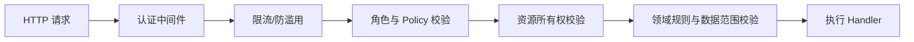

# 权限设计

## 1. 安全目标

- 匿名用户能低门槛查询，同时防止滥用外部 Provider 配额。
- 用户收藏、历史、精确位置和设置严格按所有者隔离。
- Provider 密钥、算法发布和管理操作遵循最小权限与完整审计。
- 身份系统故障不得导致越权；默认拒绝受保护资源。

## 2. 身份认证

| 场景 | 认证方式 | 生命周期/要求 |
| --- | --- | --- |
| 匿名查询 | 无身份 + 限流标识 | 不持久化不必要的设备指纹 |
| Blazor 用户会话 | ASP.NET Core Identity Cookie | Secure、HttpOnly、SameSite，滑动过期可配置 |
| 外部 API 客户端 | Bearer Token（后续） | 短期访问令牌和受控刷新 |
| 管理员 | Identity + MFA | 管理操作要求近期验证 |
| 后台任务 | Workload Identity/受限服务账号 | 不复用个人账号 |

生产环境启用邮箱确认、密码策略、登录失败锁定和可选 MFA。密码只由 Identity 的安全哈希保存。

当前 `MI-0026` 已接入 ASP.NET Core Identity Cookie 的注册、登录和退出闭环：Cookie 使用 `__Host-` 前缀、`Secure`、`HttpOnly`、`SameSite=Lax` 和 8 小时滑动过期；密码至少 10 位并包含大小写字母、数字和符号；连续 5 次失败锁定 15 分钟；账户写操作使用防伪令牌并按 IP 每分钟最多 10 次。邮箱确认在邮件发送、确认页面和重发链路完成前保持关闭，启用 `Identity:RequireConfirmedEmail` 前必须先完成该链路；MFA、外部登录和密码重置仍待后续安全任务。

`MI-0036` 在账户表单接入自研 SVG 图形验证码（`CaptchaService`）：验证码仅存服务端 `IMemoryCache` 的 SHA-256 哈希、一次性消费、3 分钟过期、去易混淆字符，不依赖第三方验证码平台，用于防脚本批量提交；验证码校验先于身份校验执行，失败不触发锁定计数。同时把 API 限流从单一 `account` 策略扩展为 account/location/analysis/authenticated/admin 五策略，`UseRateLimiter` 移到授权之后按认证身份（`ClaimTypes.NameIdentifier`）分桶，匿名按 IP 分桶，覆盖地点搜索、分析回源、用户工作区与分析报告、管理员运维等全部接口。

## 3. 授权模型

采用 RBAC + 资源所有权：

- RBAC 控制 `User`、`Administrator` 等全局角色。
- Policy 控制具体能力，如 `Algorithm.Publish`。
- Resource-based Authorization 校验收藏、历史和分析结果所有者。
- 匿名分析结果使用不可猜测 UUID；若包含用户私有配置则仅所有者可访问。

## 4. 角色定义

| 角色 | 职责 | 数据范围 | 关键权限 |
| --- | --- | --- | --- |
| Anonymous | 临时查询 | 公共地点、当前响应 | `Forecast.Query` |
| User | 日常使用 | 自己的收藏、历史、设置 | `Favorite.Manage`, `History.Read`, `Setting.Manage` |
| Administrator | 系统维护 | Provider、算法、地点、审计 | `Provider.Manage`, `Algorithm.Publish`, `Audit.Read`, `Location.Manage` |
| BackgroundWorker | 预热、清理、通知 | 指定业务表和队列 | 最小服务权限 |

`Administrator` 角色种子（`MI-0039`）：EF 迁移固化 `Administrator` 角色并幂等补授 `xuehaq@gmail.com`（邮箱字面量与 `Admin:Email` 配置默认一致）；注册该邮箱的用户由 `AccountEndpointExtensions.RegisterAsync` 在登录前自动加入角色，cookie 立即带角色声明。后台管理仅此角色可访问，非管理员经 `AccessDeniedPath` 重定向到 `/account/access-denied`。

## 5. 权限清单

| 权限代码 | 资源 | 操作 |
| --- | --- | --- |
| `Forecast.Query` | 标准预报/分析 | 查询 |
| `Tide.QueryPaid` | WorldTides 付费潮汐增强 | 仅登录用户显式请求 |
| `Favorite.Manage` | 用户收藏 | 增删改查自己的资源 |
| `History.Read` | 查询历史 | 查看和删除自己的资源 |
| `Setting.Manage` | 用户设置 | 查看和修改自己的设置 |
| `Location.Manage` | 预置地点 | 管理员维护 |
| `Provider.Manage` | Provider 配置 | 启停、测试和查看配额摘要 |
| `Algorithm.Edit` | 算法草稿 | 创建和验证草稿 |
| `Algorithm.Publish` | 算法版本 | 发布、回滚和触发重算 |
| `Audit.Read` | 审计日志 | 只读查询 |

## 6. 校验流程

前端仅负责改善体验，不能作为安全边界。数据查询必须包含用户过滤条件，禁止先读取全部记录再在内存中过滤。

## 7. 匿名查询风险控制

- 按 IP/匿名会话执行令牌桶限流，代理环境需配置可信转发头。
- 对地点搜索、分析回源和登录使用不同限流策略。
- 缓存命中可以使用较宽配额；新 Provider 回源使用更严格配额。
- 匿名用户只能查询基础天气/海况；`includeTide=true` 必须在 API 边界和 Application 查询构造层双重校验登录用户 ID。
- 对异常坐标扫描、批量遍历和持续失败行为记录安全事件。
- 不使用过度侵入式设备指纹作为 MVP 默认方案。

## 8. 数据权限与隐私

- 用户只能读写自己的收藏、历史、设置和订阅。
- 匿名查询默认不落库；为稳定性记录的日志使用网格化位置或哈希并设置短保留期。
- 用户可删除个人历史、收藏和设置；账号删除按法规与审计要求处理。
- 管理员不能在普通页面查看用户密码、令牌或完整 Provider 密钥。
- AI 输入不包含用户标识和不必要的精确历史轨迹。

## 9. 密钥和服务间认证

- Stormglass/WorldTides/Open-Meteo 商业凭据、数据库密码和 AI Key 由环境变量、Docker Secret 或专用密钥服务提供；无需 Key 的开放接口也必须受服务端限流保护。
- 配置页面只显示密钥是否存在和末尾少量掩码，不返回完整值。
- 密钥设置、轮换和删除均记录审计事件，但审计值必须脱敏。
- 数据库应用账号、迁移账号和备份账号分离。

## 10. 审计

| 操作 | 审计内容 | 保存期限 |
| --- | --- | --- |
| 管理员登录/MFA 变化 | 用户、结果、IP 摘要、TraceId | 至少 1 年 |
| Provider 配置变化 | Provider、字段差异摘要、操作者 | 至少 1 年 |
| 算法发布/回滚 | 版本、配置哈希、验证结果、操作者 | 长期保留 |
| 用户数据删除 | 用户、数据类别、时间、结果 | 按合规要求 |
| 权限拒绝 | Policy、资源类型、主体摘要 | 90 天或按运营要求 |

## 11. 主要威胁与控制

| 威胁 | 控制 |
| --- | --- |
| 暴力破解 | 锁定、速率限制、MFA、异常登录告警 |
| IDOR 越权 | 资源授权、用户过滤、不可猜测 ID、自动化测试 |
| CSRF | SameSite Cookie、防伪令牌、敏感操作 POST |
| XSS | Razor 默认编码、CSP、禁止信任 AI/Provider HTML |
| 密钥泄露 | Secret 外置、日志脱敏、轮换、最小权限 |
| 配额滥用 | 分层限流、缓存、回源锁和异常行为告警 |

## 12. 变更记录

| 版本 | 日期 | 变更说明 |
| --- | --- | --- |
| 1.0 | 2026-07-13 | 定义匿名查询、用户所有权和管理发布权限 |
| 1.1 | 2026-07-13 | 明确分层 Provider 凭据与开放接口防滥用要求 |
| 1.2 | 2026-08-12 | 记录 `MI-0026` Identity Cookie、密码/锁定、防伪和账户限流基线，并明确邮箱确认启用前置条件 |
| 1.3 | 2026-08-14 | 记录 `MI-0036` 注册/登录 SVG 验证码（服务端一次性 SHA-256、3 分钟过期、先于身份校验）与全接口限流策略（account/location/analysis/authenticated/admin，按认证态分桶） |
| 1.4 | 2026-08-18 | 落地 `MI-0039` Administrator 角色种子（EF 迁移固化 + `Admin:Email` 注册自动授权），`Location.Manage` 权限随后台预置地点 CRUD 生效 |
| 1.5 | 2026-08-21 | `MI-0060` 增加 `Tide.QueryPaid` 登录权限边界；匿名基础分析保留，付费调用日志列表仅 Administrator 可读 |
