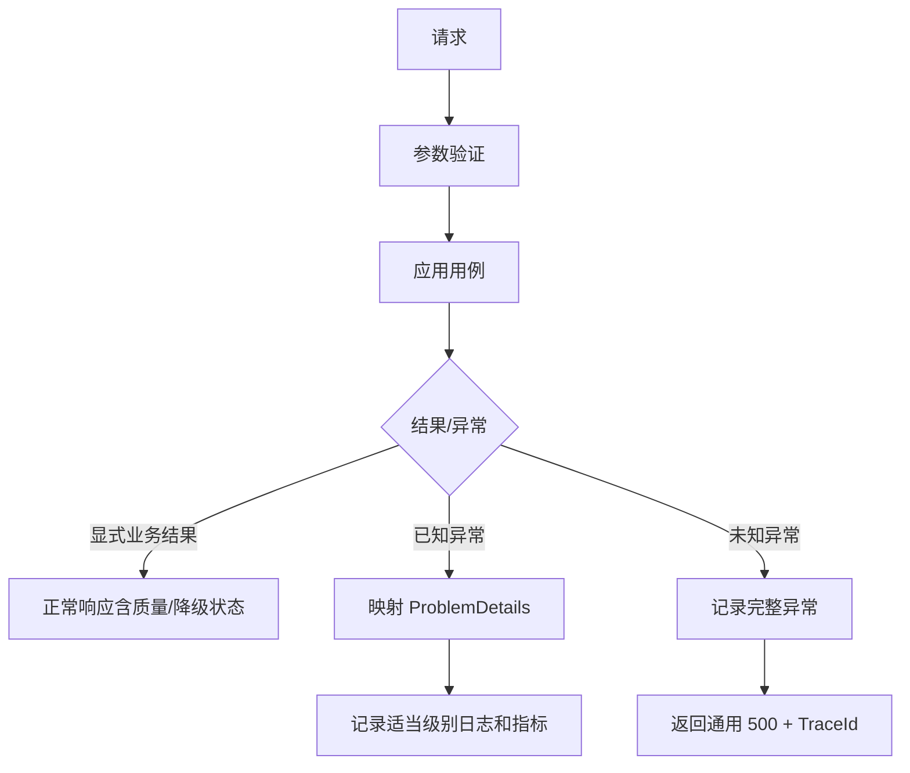

# 异常处理设计

## 1. 设计目标

- 对同类错误提供一致的 HTTP 状态、业务码和用户提示。
- 区分可重试外部故障、不可重试输入错误、业务不确定性和系统缺陷。
- 在可降级时返回有效的部分结果，不用异常掩盖数据质量状态。
- 每个错误可通过 TraceId、日志和指标诊断，同时不泄露内部实现。

## 2. 异常分类

| 类别 | 示例 | 重试 | 对外处理 |
| --- | --- | --- | --- |
| 输入验证 | 经纬度越界、时间范围不支持 | 否 | 400 + 字段错误 |
| 资源错误 | 地点/分析不存在 | 否 | 404 |
| 业务冲突 | 重复收藏、版本状态冲突 | 否 | 409 |
| 数据不足 | 浪和涌浪均缺失 | 否 | 422 或 `Unknown` 分析 |
| Provider 暂时故障 | 超时、连接失败、5xx | 有限 | 缓存/备选源降级；否则 503 |
| Provider 配置故障 | 认证失败、字段协议变化 | 否/人工 | 熔断、告警、503 |
| 缓存故障 | Redis 超时 | 通常否 | 绕过缓存继续处理 |
| AI 故障 | 超时、Schema 无效 | 不阻断 | 规则模板降级 |
| 数据库故障 | 连接失败、事务冲突 | 视操作 | 503/500，写操作保持一致性 |
| 未知系统异常 | 空引用、程序缺陷 | 否 | 500，隐藏内部细节 |

## 3. 领域结果与异常边界

以下情况应使用显式结果而不是抛出系统异常：

- 数据质量为 `Partial`、`Stale` 或 `Invalid`。
- 分析置信度低或结果为 `Unknown`。
- AI 降级为规则模板。
- 用户选择的时间范围没有推荐窗口。

异常用于无法按契约继续执行的情况，例如数据库不可用、Provider 响应无法解析或程序不变式被破坏。

## 4. 异常模型

应用层定义稳定异常/结果类型：

```text
MarineInsightException
├── ValidationException
├── NotFoundException
├── ConflictException
├── InsufficientForecastException
├── ProviderException
│   ├── ProviderTimeoutException
│   ├── ProviderRateLimitedException
│   ├── ProviderAuthenticationException
│   └── ProviderContractException
└── PersistenceException
```

异常包含 `ErrorCode` 和必要上下文标识，不直接存储面向用户的可变文本。

## 5. ProblemDetails 映射

```json
{
  "type": "https://marine-insight.local/problems/forecast-insufficient",
  "title": "海况数据不足",
  "status": 422,
  "detail": "当前预报缺少浪高和涌浪，无法可靠评估海上活动。",
  "code": "FORECAST_INSUFFICIENT",
  "traceId": "00-...",
  "missingMetrics": ["waveHeight", "swellHeight"]
}
```

| 错误码 | HTTP | 日志级别 |
| --- | --- | --- |
| `VALIDATION_FAILED` | 400 | Information |
| `UNAUTHORIZED` | 401 | Information/Security |
| `FORBIDDEN` | 403 | Warning/Security |
| `LOCATION_NOT_FOUND` | 404 | Information |
| `FAVORITE_ALREADY_EXISTS` | 409 | Information |
| `FORECAST_INSUFFICIENT` | 422 | Warning |
| `RATE_LIMITED` | 429 | Warning |
| `PROVIDER_UNAVAILABLE` | 503 | Error/Warning（取决于降级） |
| `PERSISTENCE_UNAVAILABLE` | 503 | Error |
| `INTERNAL_ERROR` | 500 | Error/Critical |

## 6. 全局处理流程



全局中间件是最后防线；领域层不得依赖 HTTP 状态码。

## 7. 重试与恢复

- 只重试幂等读取和明确瞬时故障。
- Provider 最多 2 次指数退避并加入抖动；总时限受外层超时控制。
- `400/401/403/404` 不重试；`429` 尊重 `Retry-After`，通常直接走缓存降级。
- 数据库写事务遇到并发冲突可在确认幂等后有限重试。
- AI 不进行可能显著增加延迟和成本的多次重试，失败即模板降级。

## 8. 数据源降级矩阵

| 实时源 | 有效缓存 | 备选源 | 结果 |
| --- | --- | --- | --- |
| 成功 | 任意 | 任意 | 使用实时标准批次 |
| 失败 | 有 | 任意 | 使用缓存，标记 Stale/年龄 |
| 失败 | 无 | 成功 | 使用备选源，标记 Provider |
| 失败 | 无 | 失败/无 | 返回 503 |
| 成功但关键字段缺失 | 有更完整缓存 | 任意 | 依据时效和质量选更可靠批次 |
| 成功但关键字段缺失 | 无 | 无 | 返回 Unknown 或 422 |

## 9. 前端错误状态

- 字段错误：在控件附近显示，并保留其他输入。
- 查询失败：在结果区域显示明确错误、TraceId 和重试命令，不清空上一次可用结果。
- 缓存降级：顶部状态条显示数据时间和降级原因。
- 部分缺失：指标位置显示“暂无数据”，风险区说明置信度影响。
- AI 失败：不显示错误弹窗，继续展示规则摘要；可在状态信息中标记“智能解读已降级”。
- 离线：保留已加载页面，禁用需要网络的操作并在恢复后允许刷新。

## 10. 故障测试

- Provider 超时、限流、认证失败、字段删除和非法数值。
- Redis 不可用、缓存反序列化失败和锁超时。
- PostgreSQL 连接中断、迁移未执行和并发更新冲突。
- AI 超时、非 JSON、事实不一致和高风险遗漏。
- 中间件未知异常、取消请求和客户端断开。
- 故障恢复后熔断半开、缓存刷新和健康检查状态恢复。

## 11. 变更记录

| 版本 | 日期 | 变更说明 |
| --- | --- | --- |
| 1.0 | 2026-07-13 | 建立异常分类、ProblemDetails、降级矩阵和前端状态 |
